# DTU上手说明_V2.0

## 一、基本概述

本文档旨在指导用户如何基于我司的QuecPython开发板进行DTU功能开发。

## 二、DTU简介

- 英文全称Data Transfer Unit，数据传输单元。是专门用于将来自于设备端MCU的串口数据通过无线通信网络传送至服务器的无线终端设备。
- 业务逻辑：传感器采集数据发送给设备端MCU，设备端MCU通过串口将采集到的数据通过DTU发送到服务器；服务器接收到数据可以进行分析、处理、显示、保存等操作。

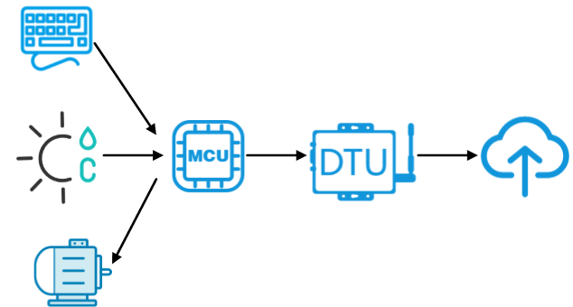

> 移远目前支持DTU的模组有：EC200U_CNLB、EC200U_EUAB、EC600U_CNLB、EC600U_CNLC、EC600N_CNLA、EC600N_CNLC、EC600S_CNLA、EC600S_CNLB

## 三、功能列表

| 功能                       | 备注                                                         |
| -------------------------- | ------------------------------------------------------------ |
| 支持本地参数配置与串口调试 | 通过上位机图形化工具配置本地参数与调试                       |
| 支持多种云平台             | 通道支持TCP、MQTT、阿里云、腾讯云、移远云云平台              |
| 支持OTA升级                | 用户可以配置阿里云OTA或者采用自己的云平台实现OTA升级         |
| 支持数据离线存储           | 在网络连接不稳定情况下，将发送失败的数据暂存至本地，在网络恢复后优先将本地数据发送至云端 |
| 多主题数据传输             | 用户配置多个主题后，按照简单的协议格式即可通过特定主题发送消息 |

## 四、开发指导

### 1、模块型号

本项目可在所有支持QuecPython的模块上进行运行，此文档的实验案例基于EC600N模组（如下图）运行。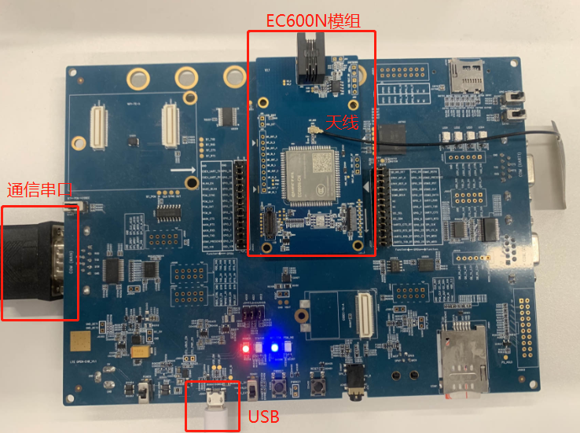

> 注意事项：
>
> 1. 在SIM卡座中插入SIM卡。
> 2. 接入天线。
> 3. 使用USB数据线连接开发板至电脑USB接口。
> 4. 连接串口至电脑。

### 2、下载脚本

#### 2.1、获取实验代码

本实验项目代码仓库：`https://github.com/QuecPython/solution-DTU`。

> 注意：本实验基于`v2.0`分支代码。

#### 2.2、编写配置文件

DTU配置文件路径：`solution-DTU/code/dtu_config.json`。

本实验案例，基于mqtt私有云做如下配置：

1. 系统配置

   

2. mqtt私有云配置

   

### 3、下载代码到设备

接上数据线，连接至电脑，短按开发板上的**PWRKEY**按键启动设备，并在QPYcom上选择MI05接口连接。

### 4、创建下载项目

切换到下载选项卡，点击创建项目，并输入任意项目名称。

> 此处我们创建名为`dtu`的项目。

### 5、选择导入文件

右击`usr`目录，在弹出的选择框中点击**一键导入**，继而选择我们DTU代码仓库中的**code**文件夹 —— 即将code中的所有代码一键导入至模组。如下图所示：

### 6、导入脚本

点击右下角`下载脚本`按钮，即可开始导入脚本。

### 7、运行DTU应用

切换至"文件"选项卡，在右边选中"dtu.py"，点击运行按钮，即可开始dtu调试运行，如果需要上电自动运行，只需要将"dtu.py"更名为"main.py"即可实现上电自动运行。

DTU运行成功，在QPYcom的"交互"窗口中，可观察到打印如下。

> 解释：可以看到，打印出的日志信息中，`mqtt start`和`get_status(): True`表面设备启动成功。

## 五、基于MQTT协议的DTU案例演示

本节以通信猫的MQTT服务器为例演示DTU方案的运行效果。

### 1、在线MQTT客户端

访问`mq.tongxinmao.com`可见如下页面：

> 从上文图示中可以获取mqtt服务器相关参数 —— 服务器参数与我们的DTU配置的参数保持一致。
>
> - 服务器地址： ` mq.tongxinmao.com `
> - 端口：`18830`
> - 用户名：<空>
> - 密码：<空>
>
> 订阅主题：`/public/test/`
>
> 发布主题：`/public/test/`

配置好在线客户端后，点击`Connect连接`（点击后按钮变为`断开Disconnect`即表示在线客户端已连接）。

接下来，我们分别进行**向云端发送消息**和**云端向设备发送信息**两个方向来演示案例。

> 解释：
>
> - 向云端发送消息：即DTU接收串口数据，发送给MQTT服务，我们通过在线客户端观察收到的消息数据。
> - 云端向设备发送信息：即我们通过在线客户端发送消息，DTU收到订阅的消息数据后写入串口，我们通过串口调试工具观察收到的消息数据。

### 2、向云端发送消息

> 本实验案例实验串口调试工具为`QCOM`。下载连接：`https://python.quectel.com/download`。

1. 打开串口调试工具，选择并打开串口。

2. 在串口调试工具中按指定格式传入`<topic_id>,<msg_length>,<msg>`值, 需要发送的数据，并点击"Send Command"。

   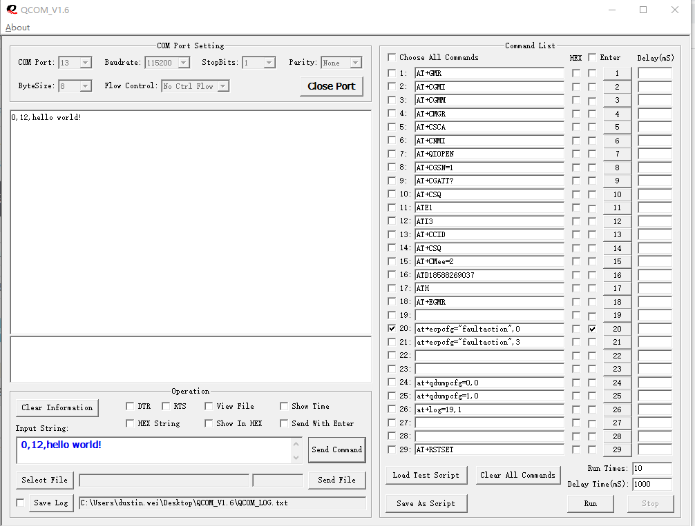

3. DTU收到数据，并发送至云端

   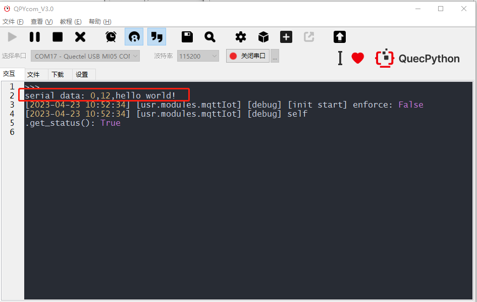

4. 云端接收到的消息

   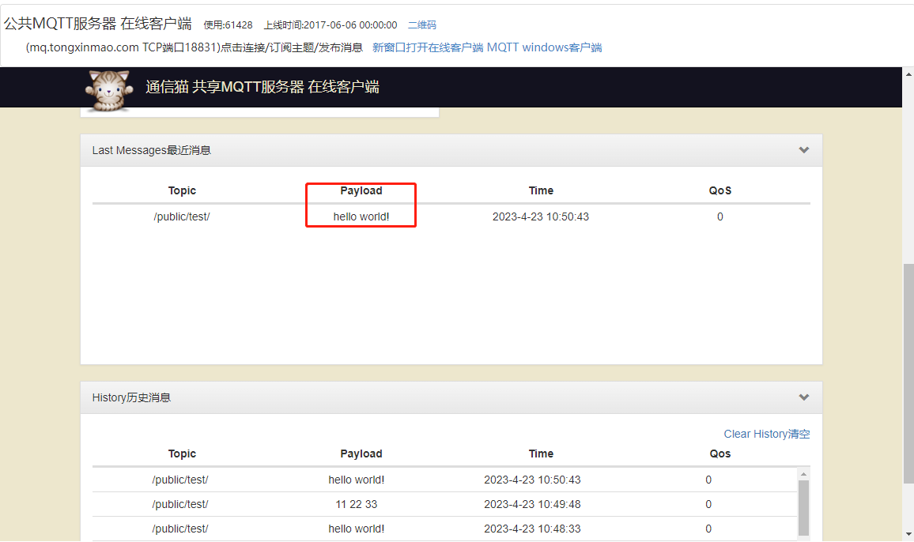

### 3、云端向设备发送信息

在mqtt公共服务器web页面中订阅之前配置的主题。通过`Publish发布`按钮，发送消息。

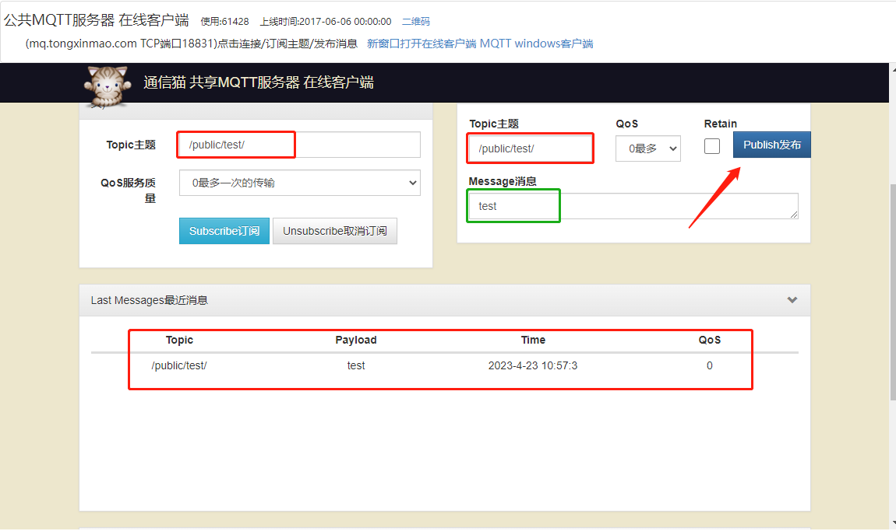

串口收到的消息。

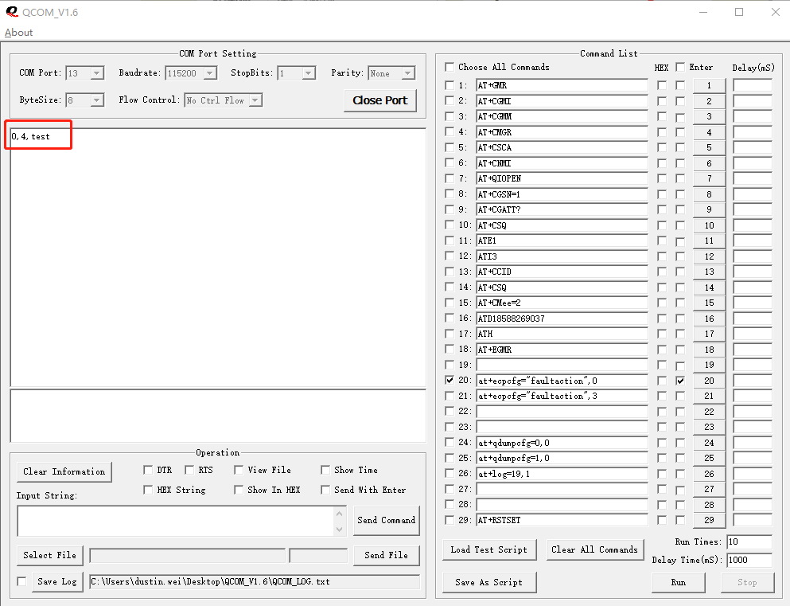

## 六、DTU GUI工具使用说明

DTU TOOL工具现阶段主要为客户开发调试使用，DTU TOOL工具提供基础的查询与设置功能，以及模拟MCU测试和DTU模块数据收发，用户可使用USB to TTL模块连接PC与DTU。

DTU TOOL基于wxPython开发，现阶段已编译的dtu_gui.exe仅支持Windows系统，
用户在Linux/macOS配置Python环境并安装wxPython lib后可直接运行dtu_tool.py或自行编译对应版本的exe程序。

### 1、工具界面

交互界面展示。

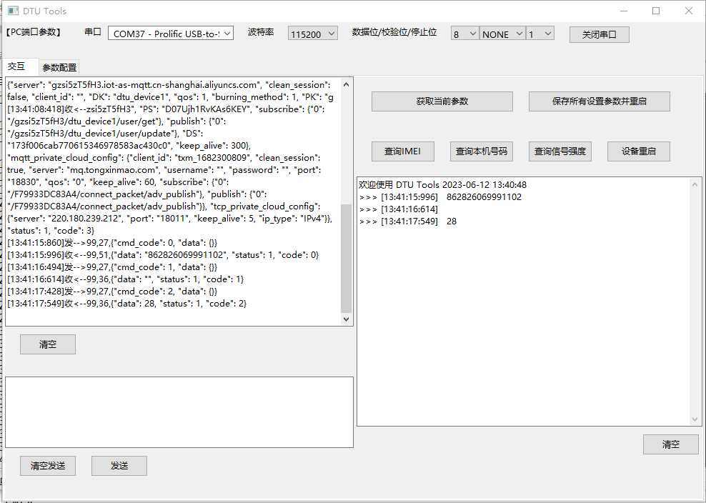

> 工具包含一般操作，如`获取当前配置参数`、`查询IMEI`等。

参数配置界面展示。读取和配置参数，如下图。

> 点击主页`获取当前参数`即可读取当前DTU模组配置参数，参数显示在参数配置页面，用户可根据该页面自行修改参数配置后点击`保存所有设置参数并重启`。

### 2、运行DTU TOOL 工具

打开编译后的执行文件`dtu_tool.exe`或者运行脚本`dtu_tool.py`，启动工具。

选择并打开串口。

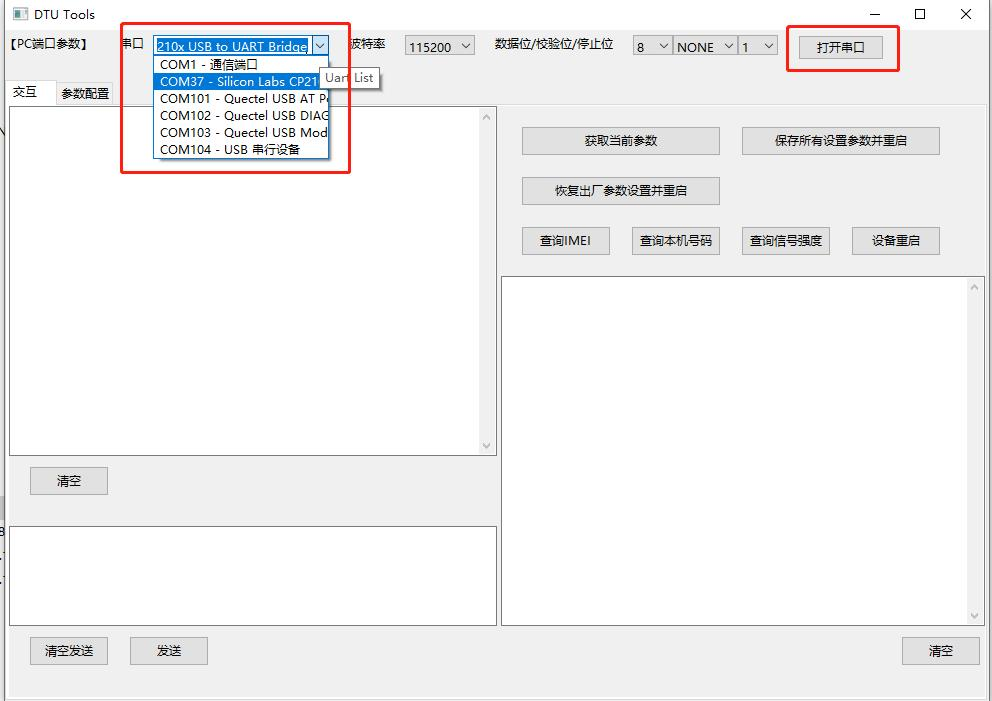

成功打开后，会有欢迎语句在交互界面打印。

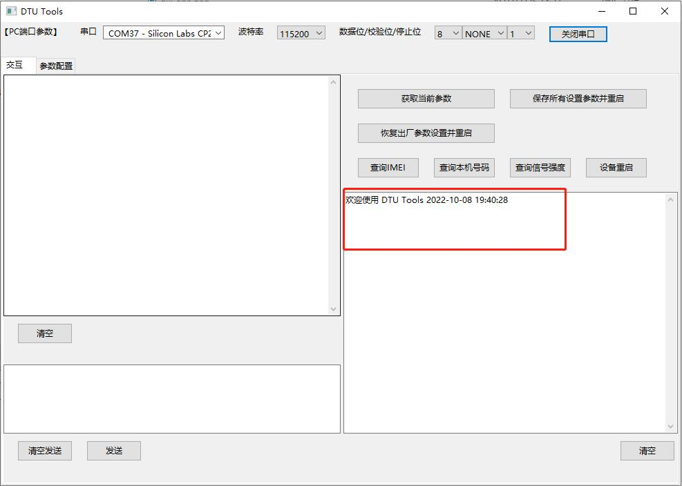

### 3、DTU GUI 功能介绍

目前工具箱的功能如下：

| **按键名**                 | **功能**                                                     |
| -------------------------- | ------------------------------------------------------------ |
| **获取当前参数**           | 获取DTU当前配置参数，并跳转到`参数配置`界面中显示具体参数    |
| **保存所有设置参数并重启** | 将当前`参数配置`界面中配置参数写入DTU，并重启DTU             |
| **恢复出厂参数设置并重启** | 删除所有配置参数，恢复出厂参数，并重启DTU                    |
| **查询IMEI号**             | 获取DTU模组IMEI号                                            |
| **查询本机号码**           | 获取DTU中SIM卡手机号码                                       |
| **查询信号强度**           | 获取csq信号强度，信号强度值范围0 ~ 31，值越大表示信号强度越好 |
| **设备重启**               | 重启DTU设备                                                  |

#### 3.1、查询IMEI号

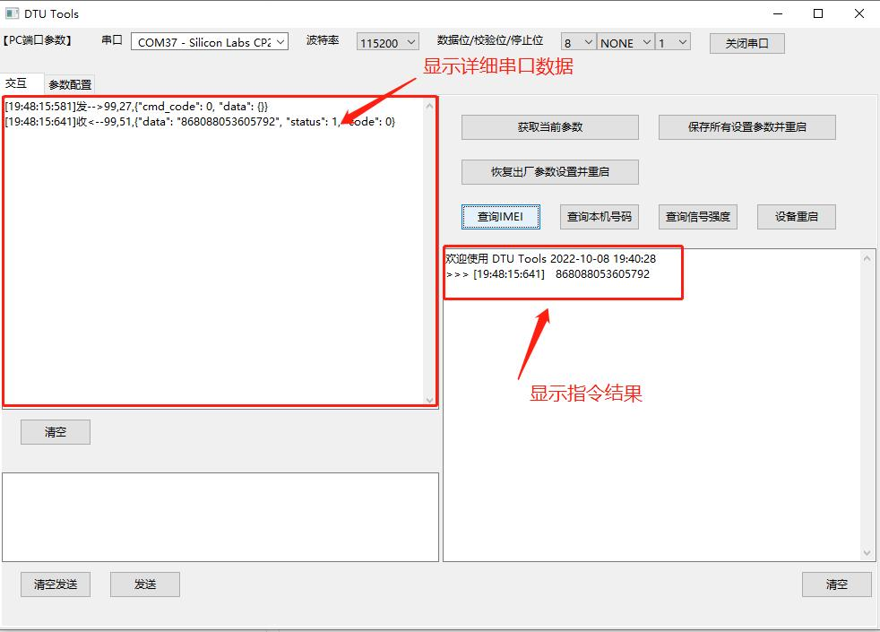

在左侧串口数据显示框中以字符串格式显示出详细地串口数据，右侧命令消息框显示出查询获得的IMEI号。

#### 3.2、获取DTU当前配置参数

点击`获取当前参数`按钮后，立即跳到参数配置界面。
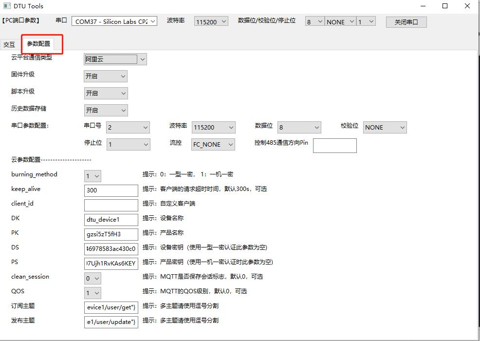

点击交互界面可以看到工具和DTU具体交互串口信息。
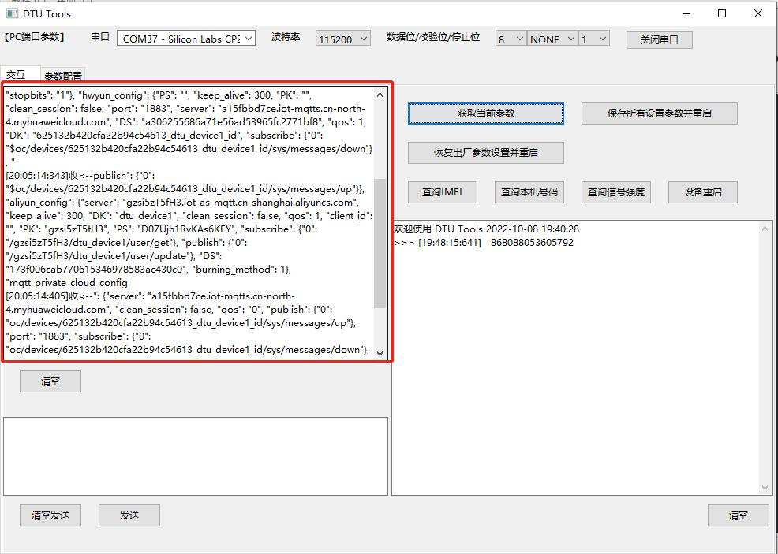

#### 3.3、导入配置参数

读取当前配置参数后，进入参数配置界面，可以根据实际需求修改配置（也可以不读取，直接填写配置）。

#### 3.4、基本参数配置

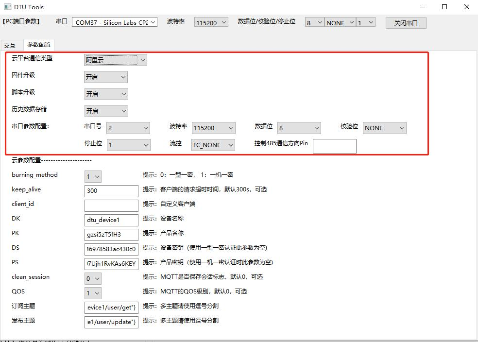
基本配置参数项如上图

| **参数名**     | **含义**                                                     |
| -------------- | ------------------------------------------------------------ |
| 云平台通道类型 | 云平台选择，可选项：`阿里云`、`腾讯云`、`华为云`、`移远云`、`TCP私有云`、`MQTT私有云` |
| 固件升级       | 是否开启固件OTA升级                                          |
| 脚本升级       | 是否开启项目脚本OTA升级                                      |
| 历史数据存储   | 当通信异常，DTU无法向云端发送数据时，将发送数据保存，待通信恢复正常后重新发送 |
| 串口号         | 外部MCU连接DTU串口号，可选项：`0`，`1`，`2`                  |
| 波特率         | 串口波特率                                                   |
| 数据位         | 奇偶校验                                                     |
| 停止位         | 停止位长度，可选项：`1`，`2`                                 |
| 流控           | 硬件控制流，可选项：`FC_NONE`，`FC_HW`                       |

| 控制485通信方向Pin | 串口发送数据之前和之后进行拉高拉低指定GPIO，用来指示485通信的方向。如`1`、 `2`代表`UART.GPIO1`、`UART.GPIO2`。

#### 3.5、云参数配置

云参数配置项会根据基本`云平台通信类型`选择值变化。当`云平台通信类型`为阿里云时，云参数配置项如下：

当`云平台通信类型`为移远云时，云参数配置项如下：
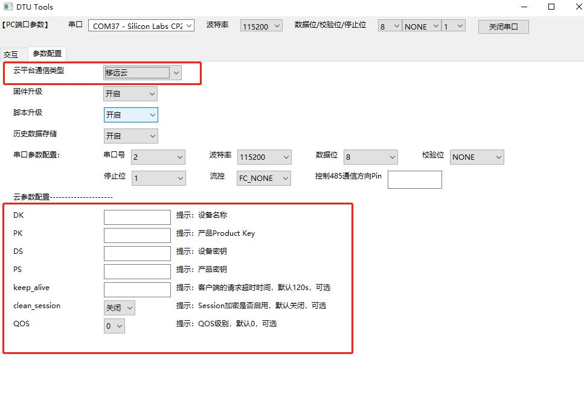

### 4、数据发送框的格式要求

数据发送的格式与MCU和DTU通信格式一致。针对和云端通信协议的不同，模块和外部设备（如MCU）通信协议也会不同。当模块和云端通信使用TCP协议时，由于TCP和串口都是数据流的形式，所以直接透传数据，不做任何处理；当模块和云端通信使用MQTT协议时，为了区分不同的数据帧，模块的串口对外协议采用简单的数据帧：
`<topic_id>,<msg_len>,<msg_data>"`。
**注：移远云不支持Topic设置，`<topic_id>`统一为`"0"`**

**示例报文：**

- 上行报文：

`“1,6,abcedf”`

- 下行报文：

`“1,6,ijklmn”`

模块和外部设备（MCU）上行报文和下行报文都是采用字符串格式，数据项之间采用`,`相隔。
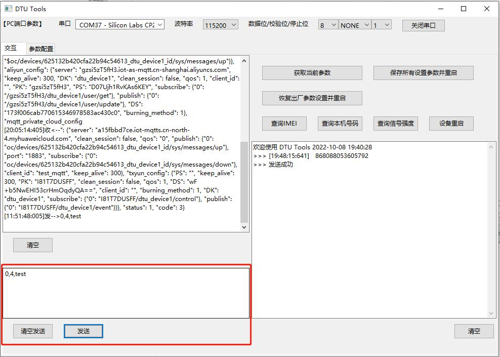