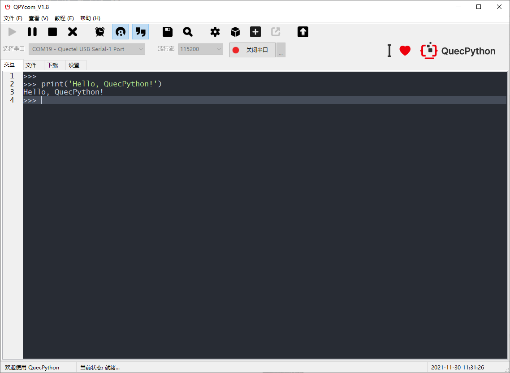

## 概述

------

------

> - 模块端支持UART、GPIO、LTE等功能。
> - 模块通过UART端口与MCU进行通信。
> - 模块可使用MQTT或TCP协议与云平台进行通信。目前支持移远云、阿里云、腾讯云、华为云或者用户私有的MQTT或TCP协议云平台。

------

------

------

> 针对DTU所有的单元功能，GUI均提供了对应的交互入口，用于通过PC调试DTU，可作为终端产品开发前的快速原型验证。 

------

------

------

QPYcom开发工具

QPYcom工具是一个集**QuecPython repl交互、PC和模组间文件传输、文件系统镜像制作并打包到固件包、及固件烧录等各种功能**于一体的强大利器。

 用户如需进行DTU的二次开发，使用QPYcom将会大大提高开发的效率。

<a ref='https://python.quectel.com/download'>点此下载QPYcom工具</a>。

 QPYCom的使用文档，参见安装目录下的`docs`文件夹。 

## 参数

华为云

阿里云

腾讯云

MQTT私有云

移远云

tcp私有云

## 资料

## FAQ