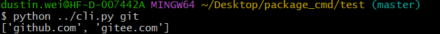
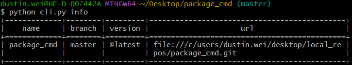
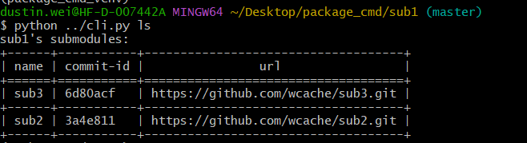
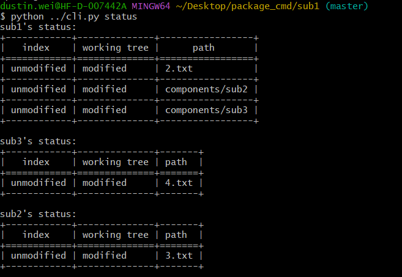
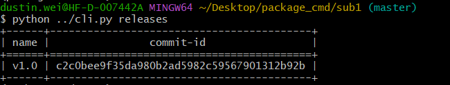
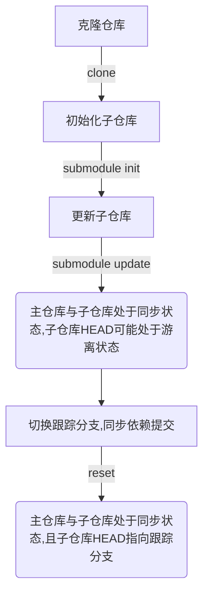

# 《QuecPython Client命令说明》

## 1、`git`

展示当前支持的git仓库地址。（目前仅支持github）



## 2、`import`

根据包名称或者url，从远程仓库中导入包。

工作流：

1. 未指定包名称或url情况下，显示默认远程仓库可下载的包及其url。
2. 指定包名或url情况下。
   1. 根据包名查找到url，或直接使用url。
   2. 根据url克隆远程仓库到本地。
   3. 切换到根据`--branch`选项指定的分支。
   4. 递归更新组件（子仓库）。
   5. 将子组件游离状态的HEAD指针重新指向`master`分支。（所有子组件`git checkout master`）。

## 3、`bind`

关联本地仓库到远程。

工作流：

1. 加载本地仓库。
2. 添加远程关联仓库（`git remote add origin <url>`）。

> 默认设定一个远程`origin`。

## 4、`unbind`

解除关联的远程仓库。

工作流：

1. 加载本地仓库。
2. 解除关联远程仓库（`git remote remove origin`）。

> 默认必有一个远程`origin`。

## 5、`info`

展示本地仓库基本信息。



## 6、`update`

根据分支、标签、提交id切换本地仓库，且自动同步子模块依赖。

工作流：

1. 加载本地仓库。
2. 根据`--index`选项指定分支切换。
3. 若指定`--pull`标志，则会拉取默认origin远程仓库最新代码。
4. 递归更新子模块（不同分支可能添加了不同的子模块，GIT会根据`.gitmodules`文件去更新子模块）。
5. 设定子模块游离HEAD指针指向默认master分支。

## 7、`ls`

递归列举出从应用包至各组件的依赖树。



## 8、`new`

创建一个git空仓库。

工作流：

1. 若不指定仓库初始化路径，则默认初始化在当前工作路径下。
2. 初始化空仓库。
3. 根据选项`--url`设定关联的远程仓库，默认远程命名`origin`。

## 9、`remove`

移除一个组件。

> GIT仓库移除一个组件使用`git rm -rf <组件路径>`。会同步在`.gitmodules`文件删除组件信息。当主仓库`push`后，仓库`.git/config`中的组件依赖关系会更新。

## 10、`add`

添加组件到当前仓库。

工作流：

1. 加载本地仓库。
2. 添加组件（根据`--branch`选项设定跟踪分支，默认`master`）。
3. 设定游离HEAD指向默认分支`master`。

## 11、`status`

递归显示当前仓库和子组件的状态。



## 12、`publish`

自动提交和上传至服务器（包括组件）。

工作流：

1. 加载本地仓库。
2. 递归提交子组件。
   1. `git add .`
   2. `git commit <message>`
   3. `git push --recurse-submodules=on-demand`
3. 提交应用仓库。

## 13、`releases`

显示所有标签。



## 14、`sync`

同步应用对组件的依赖关系。

> 子组件有新commit后，主仓库也需要新commit才能保持与子组件的同步关系。

工作流：

1. 加载本地仓库。
2. 判断本地是否有新提交产生（比较远程HEAD的提交id与是否处于最新，如果不是，说明本地有新提交，则需要push）。
3. 递归push产生新提交的子模块。
4. push主仓库。

## 15、`deploy`

补全丢失的组件,云端同步仓库的依赖关系 有缺失的子仓库会补全。

> 若使用remove删除组件并push后，是无法通过deploy补全的。

工作流：

1. 加载本地仓库。
2. 读取本地仓库`.git/config`配置文件。
3. 根据配置文件中记录的子模块，重新添加。
4. 更新子模块。
5. 重新设定游离的HEAD指向`master`分支（`git checkout master`）。


```text
手上工作的详细进度发我下，每个任务完成了哪些，还有哪些没做，遇到了哪些难题，解决方案是什么。

目前进行的只有"QuecPython包管理器"。

总共13个功能（每个功能对于一个指令）。
目前已完成：add、git、import、info、ls、new、releases、remove、status、update。
暂未完成：deploy、publish、sync。

遇到问题1：克隆带有子模块的仓库时，子模块HEAD处于游离状态（这是GIT默认行为），而publish操作过程中需要commit操作，游离状态下无法commit。
解决方案1：在import、add等涉及更新子模块的操作中，根据.gitmodules中设定的子模块跟踪分支切换至该分支（默认设定跟踪master）。

遇到问题2：sync同步子模块，检查子模块是否有新提交，只对新产生的提交同步。
解决方案2：此场景我的理解是，用户在子模块中做了修改并且在子模块中提交了，此处我这也是递归push，以保持整个主仓库和子模块之间的依赖。

遇到问题3：remove删除分支的同时会删除依赖，后续deploy如何补全恢复？
解决方案3：每个应用仓库（主仓库），新增一个文件以记录依赖的子模块，由quecpython维护。

遇到问题4：涉及pull和push的操作，都需要一个关联的远程分支。
解决方案4：在import等操作中设置默认名为origin分支、或由用户自己添加。这个分支名必须存在。
```


------

业务流总结：


### 1、克隆仓库（包含子仓库）




