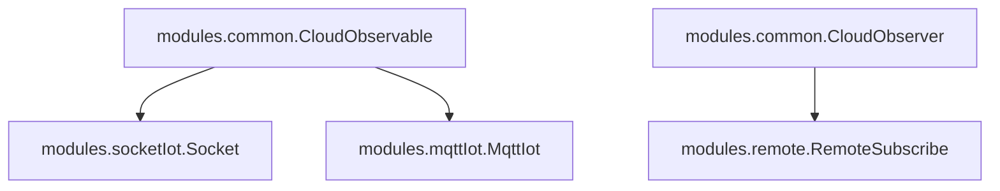
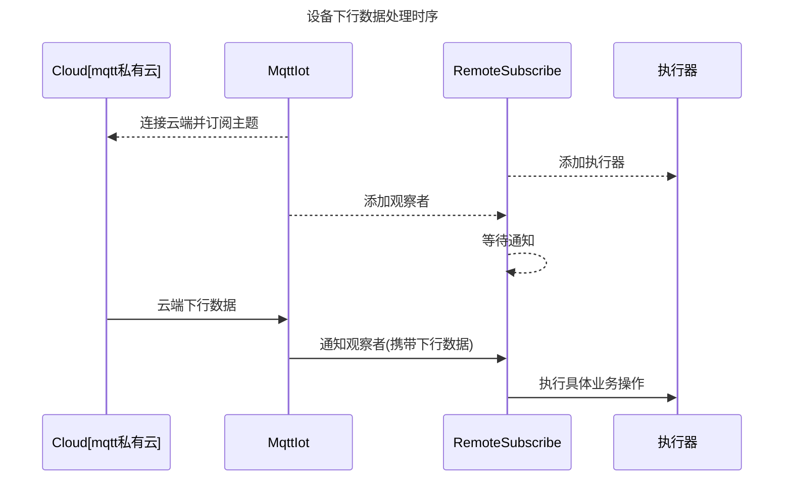
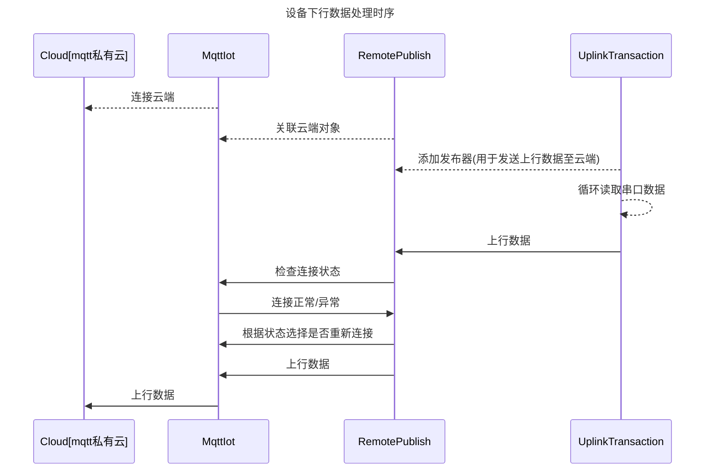

### 一、功能

- TCP透传
- MQTT透传
-  232串口收发
-  485收发（字节），modbus协议
- SIM卡信息读取
-  APN设置
-  掉电保存 
- FOTA
- 看门狗


### 二、模块列表

> demo.py: TCP、MQTT透传数据演示demo 
>
> dtu_transaction.py: 数据上行下行、OTA升级业务控制
>
> settings.py: 配置模块，用于读、写配置文件
>
> dtu_config.json: 配置文件
>
> modules/mqttIot.py: MQTT私有云对象类
>
> modules/socketIot.py: TCP私有云对象类
>
> modules/remote.py: 云端消息发布器和订阅器，用于兼容不同云端的上行和下行消息。
>
> serial.py: 串口通信实现
>
> logging.py: 日志模块
>
> common.py: 通用模块
>
> umodbus: modbus协议实现
>
> modbus_adapter.py: modbus协议适配器模块，主要是对modbus协议转换适配。


### 三、设计模式

采用**观察者模式**实现。

#### 1、介绍

**概念：**当对象间存在一对多关系时，则使用观察者模式（Observer Pattern）。比如，当一个对象被修改时，则会自动通知依赖它的对象。观察者模式属于行为型模式。 

**意图：**定义对象间的一种一对多的依赖关系，当一个对象的状态发生改变时，所有依赖于它的对象都得到通知并被自动更新。

**主要解决：**一个对象状态改变给其他对象通知的问题，而且要考虑到易用和低耦合，保证高度的协作。

**何时使用：**一个对象（目标对象）的状态发生改变，所有的依赖对象（观察者对象）都将得到通知，进行广播通知。

**关键代码：**在抽象类里有一个列表存放观察者们。

#### 2、类设计

##### 2.1、类定义

设计思路：云端类(`Socket`和`MqttIot`)对象都是一个**可被观察者**，当有下行数据时，会**通知**`RemoteSubscribe`(订阅器，**一个观察者**)，而`RemoteSubscribe`会根据订阅主题区分业务从而调用不同的**执行器**来处理。

类继承图示：



基类介绍：

> CloudObservable: 可被观察者对象类，主要用于定义各种云对象类时被继承。主要有以下方法。
>
> - addObserver： 添加一个观察者对象
> - delObserver：移除一个观察者对象
> - notifyObservers：通知所有观察者
> - through_post_data：透传数据发布
> - post_data：云端消息发布
> - ota_request：云端发布OTA升级计划请求
> - ota_action：云端发布OTA升级
>
> CloudObserver：观察者对象类，主要用于被动接收通知。主要有以下方法。
>
> - execute：在被被观察者通知后，会调用该方法。

子类介绍：

> Socket: 实现tcp私有云业务。是一个被观察者。主要方法有。
>
> - __recv： 接收云端下行消息，并通知观察者。
> - __send：发送消息给云端。
>
> MqttIot：实现mqtt私有云业务。是一个被观察者。主要方法有。
>
> - __subscribe_topic：订阅主题。
> - __sub_cb：订阅主题的消息回调函数。
> - through_post_data：透传数据。
>
> RemoteSubscribe: 订阅器，是一个观察者，用于接收云端下行数据通知。主要方法有。
>
> - execute：当被通知时，调用该方法执行具体的业务处理流程。（不同的业务使用不同的执行器处理，在该类对象中定义2种执行器：\_\_executor（普通执行器），\_\_ota_executor（专用于执行ota升级的执行器））
> - add_executor：添加执行器。

执行器：

在`dtu_transaction.py`中，定义了三种执行器。`DownlinkTransaction`、`OtaTransaction`。

- `DownlinkTransaction`：下行数据执行器。
- `OtaTransaction`：OTA升级执行器。
- `UplinkTransaction`: 上行数据执行器。

##### 2.2、下行数据处理

下行数据处理时序图：

> 以mqtt私有云为例。



##### 2.3、上行数据处理

在`dtu_transaction.py`中，定义了`UplinkTransaction`，用于接收串口数据并上传云端。

主要属性：

- `__remote_pub`: 远程发布器，用于上传数据至云端。是`modules.remote.RemotePublish`类对象。
- `__serial`: 串口对象，用于串口数据收发。定义于`modules.serial.Serial`。

主要方法：

- `uplink_main`：用于接收串口数据，并上传云端。



##### 2.3、接口使用示例

> 具体示例代码，请参考demo.py。

### 四、modbus模块支持

`umodbus`包实现modbus协议。

`modbus_adapter.py`模块是modbus协议适配器模块，主要是对modbus协议转换适配。

使用案例：

```python
from usr.modules.serial import Serial
# >>> 初始化串口对象
serial = Serial("2", 115200, 8, 0, 1, 0)
# <<<

from usr.modbus_adapter import ModbusAdapter
# >>> 初始化modbus适配器对象
adapter = ModbusAdapter()
adapter.add_channel(serial)  # 添加串口对象用于通信
# <<<

# 示例
adapter.read_coils({"slave": 1, "startAddress": 0, "quantity": 3})
# '{"slave": 1, "value": [true, false, false], "quantity": 3, "startAddress": 0}'
```

### 五、配置文件

> 具体实现参考`settings.py`模块。

`settings.py`模块定义配置相关接口，将云参数保存在本地实现掉电保存持久化。

默认配置文件路径"/usr/dtu_config.json"。

方法：

```python
class Settings(Singleton):
    
    def init(self):
        # 配置对象初始化，读取本地配置文件
        pass
    
    def get(self):
        # 获取当前配置，返回一个配置字典
        pass
    
    def set(self, opt, val):
        # 设置一个配置项
        pass
    
    def save(self):
        # 保存当前配置
        pass

settings = Settings()  # 全局settings对象，用户可以直接导入使用
```

### 六、看门狗

参考`watch_dog.py`模块。

```python
import _thread
from usr.watch_dog import dog

if __name__ == '__main__':
    def work_fun(p1):
        for i in range(5):
            logger.debug('{} feed dog at {}, index {}'.format(_thread.get_ident(), utime.time(), i))
            dog.feed(_thread.get_ident())  # 线程内部需定时喂狗, 参数是当前线程id
            time.sleep(10)
        logger.debug('{} finished!'.format(_thread.get_ident()))

    args = ('hello',)  # 线程执行函数参数
    t1_id = _thread.start_new_thread(work_fun, args)
    dog.add_thread(t1_id, work_fun, args)  # 看门狗添加监控线程，每20s检测线程状态。如果20s内线程状态未更新，则认为线程异常退出，重新拉起线程
```

### 七、工具函数

`utils.py`中定义。获取SIM卡信息，设置APN等。