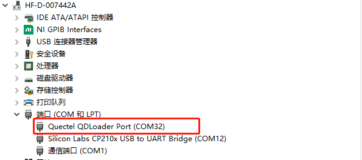
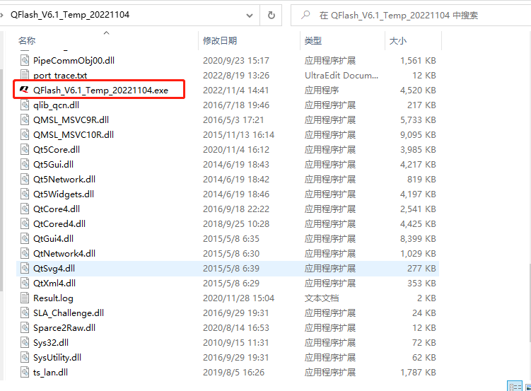
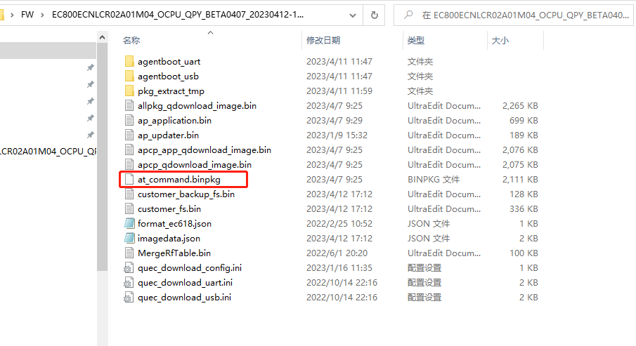
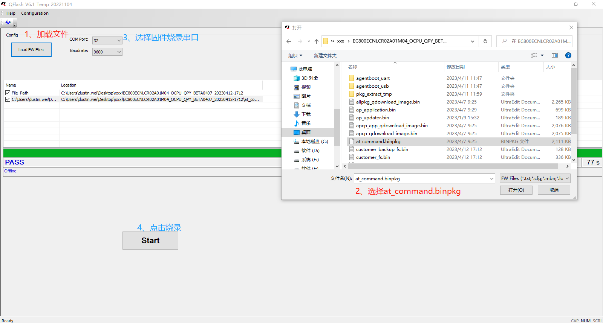

# 800E固件烧录

> 烧录前，请确保boot串口可用。

#### 1、前置准备

800E模组，usb boot接地后，重启后会出现`Quectel QDLoader Port`端口。此端口即为QFLash烧录固件需要选择的端口。如下图所示：

#### 2、安装烧录工具

解压`QFlash_V6.1_Temp_20221104.zip`并安装。

> 运行`QFLash_V6.1_Temp_2021104.exe`。

#### 2、烧录流程

解压压缩包`EC800ECNLCR02A01M04_OCPU_QPY_BETA0407_20230412-1712.zip`。如下图：

> `at_command.binpkg`是烧录需要加载的文件。

使用QFlash烧录固件。

> 加载文件后，需要确保烧录串口存在。注意：如果不存在，请重重启模组。

