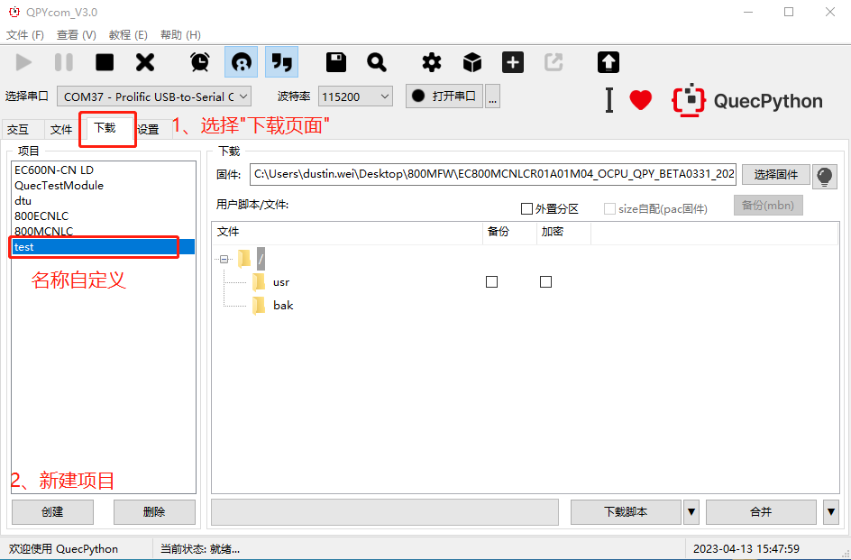

# 800M固件烧录

#### 1、安装烧录工具

解压`QPYcom_V3.0.zip`。

> `QPYcom.exe`可以用于800M固件烧录。

运行`QPYcom.exe`。

#### 2、烧录流程

压缩包`EC800MCNLCR01A01M04_OCPU_QPY_BETA0331_20230413-1537.zip`为固件文件。

> 注意：
>
> ​	1、固件压缩包无需解压。
>
> ​	2、无需手动选择串口，无需打开串口。

##### 2.1、新建项目

##### 2.2、选择固件

##### 2.3、固件下载(烧录)

