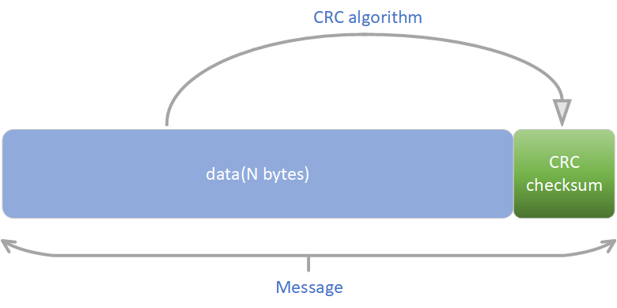

CRC校验学习笔记

[TOC]

## 一、CRC校验概念

​	CRC（Cyclic Redundancy Checksum）—— 即循环冗余校验和。其通过数学运算，将数据（N个字节）与校验和（一个值）建立约定关系，从而使得能够通过校验和来检验数据完整性(纠错)的目的。通常用于计算机与外存储器之间通信的数据校验。

> 常见的检测方式有：奇偶校验、因特网校验和循环冗余校验等。

## 二、使用概述



​	如上图所示，发送方将需要发送的数据 `data`经由CRC算法(`CRC algorithm`)计算得出**CRC校验和**(`CRC checksum`)，然后将校验和拼接于字节数据尾部，从而得到完整的一帧报文。

> 接收方校验时，按照相同的算法得出的校验应当是一致的。否则即为数据不完整或被破坏，数据无效。
> 从性能和开销上考虑，均优于奇偶校验等。

## 三、CRC算法定义

### 1、多项式

​	CRC算法采用**模二除法**计算(比如，将一个字节除以一个标准除数，从而得出该字节的CRC值)，故有**标准除数**，该标准除数一般用**多项式**表示。

> message：源数据
>
> poly：多项式（即标准除数）
>
> CRC计算公式：check_value = \<message\> *mode* \<poly\>

​	以CRC8为例（8即为8个bit，指生成的CRC校验值为一个字节）。标准除数为 `0x107`的多项式为 `G(X)=X^8+X^2^+X+1`。其中，有幂次表示该位bit值为1，如 `X^8`表示第8bit为1。省略bit位为0的项。

> 生成的多项式首位必定为1。

| 下标(幂次) | 8   | 7   | 6   | 5   | 4   | 3   | 2   | 1   | 0   |
|--------|-----|-----|-----|-----|-----|-----|-----|-----|-----|
| 值      | 1   | 0   | 0   | 0   | 0   | 0   | 1   | 1   | 1   |

### 2、多项式简记式

​	把多项式首部1省略，得出的即为多项式的简记式。如多项式 `0x107`的简记式为 `0x07`。

### 3、数据宽度

​	即CRC校验码的bit位长度。

> CRC校验码的长度，始终比多项式除数少1，与简计式长度一致。

### 4、初始值与结果异或

​	在一些标准中，规定了初始值，则数据在进行上述二项式运算之前，需要先将要计算的数据与初始值的最低字节进行异或，然后再与多项式进行计算。

​	而在结果异或值不为零的情况下，则需要将计算得到的CRC结果值再与结果异或值进行一次异或计算，得到的最终值才是我们需要的CRC校验码。

> 初始值与结果值的位数要求与数据宽度一致。

### 5、输入值反转与输出值反转

​	输入值反转的意思是在计算之前先将二项式反转（高低bit位反转），然后再用得到的新值和数据进行计算。如对于 `G(X)=X^8+X^2^+X+1`（`0x107`），其正向值为 `1 0000 0111`，反转值则为 `1110 0000 1`。

​	输出值反转则是将最终得到的CRC结果反转。

​	通常，输入值反转后的结果值也会是反转的，所以这两个选项一般是同向的，我们只有在在线CRC计算器中会看到自由选择正反转的情况存在。

## 四、常见的CRC算法模型

​	以下为国际常用模型表。


| 名称        | 多项式                                                                                  | 简记式         | 应用举例                                                                                          |
|-----------|--------------------------------------------------------------------------------------|-------------|-----------------------------------------------------------------------------------------------|
| CRC-8     | X^8+X^2+X+1                                                                          | 0X107       |                                                                                               |
| CRC-12    | X^12+X^11+X^3+X^2^+X+1                                                               | 0X180F      | telecom systems                                                                               |
| CRC-16    | X^16+X^15+X^2+1                                                                      | 0X18005     | Bisync, Modbus, USB, ANSI X3.28, SIA DC-07, many others; also known as CRC-16 and CRC-16-ANSI |
| CRC-CCITT | X^16+X^12+X^5+1                                                                      | 0X11021     | ISO HDLC, ITU X.25, V.34/V.41/V.42, PPP-FCS                                                   |
| CRC-32    | X^32+X^26+X^23+X^22+X^16+X^12+X^11+X^10+X^8+X^7+X^5+X^4+X^2+X+1                      | 0x104C11DB7 | ZIP, RAR, IEEE 802 LAN/FDDI, IEEE 1394, PPP-FCS                                               |
| CRC-32C   | X^32+X^28+X^27+X^26+X^25+X^23^+X^22+X^20+X^19+X^18+X^14+X^13+X^11+X^10+X^9+X^8+X^6+1 | 0x11EDC6F41 | iSCSI, SCTP, G.hn payload, SSE4.2, Btrfs, ext4, Ceph                                          |

## 五、CRC校验流程

* （1）选定一个标准除数（多项式）。
* （2）发送数据时，根据标准除数计算得出crc校验码。
* （3）将这个校验码附在原数据尾部。
* （4）接收端将接收到的数据按照相同标准除数（多项式）计算得出相同校验码则数据完整，否则数据错误。

## 六、示例

​	以CRC8为例，如下：

### 1、计算法

```python
def cal_crc_perbyte(raw, poly=0x07):
    # raw: 0~255
    crc = raw
    for _ in range(8):  # 每个字节冗余计算，共8次
        if crc & 0x80:
            crc = (crc << 1) ^ poly
        else:
            crc <<= 1
    return crc & 0xFF  # 最终结果取低位一个字节


def gen_crc8(rawbytes):
    crc = 0x00
    for data in rawbytes:
        crc = cal_crc_perbyte(crc ^ data)
    return crc


def check_crc8(rawbytes, crc):
    return gen_crc8(rawbytes) == crc
```

### 2、查表法

```python
CRC8_TABLE = [
    0x00, 0x07, 0x0e, 0x09, 0x1c, 0x1b, 0x12, 0x15, 0x38, 0x3f, 0x36, 0x31, 0x24, 0x23, 0x2a, 0x2d, 
    0x70, 0x77, 0x7e, 0x79, 0x6c, 0x6b, 0x62, 0x65, 0x48, 0x4f, 0x46, 0x41, 0x54, 0x53, 0x5a, 0x5d, 
    0xe0, 0xe7, 0xee, 0xe9, 0xfc, 0xfb, 0xf2, 0xf5, 0xd8, 0xdf, 0xd6, 0xd1, 0xc4, 0xc3, 0xca, 0xcd, 
    0x90, 0x97, 0x9e, 0x99, 0x8c, 0x8b, 0x82, 0x85, 0xa8, 0xaf, 0xa6, 0xa1, 0xb4, 0xb3, 0xba, 0xbd, 
    0xc7, 0xc0, 0xc9, 0xce, 0xdb, 0xdc, 0xd5, 0xd2, 0xff, 0xf8, 0xf1, 0xf6, 0xe3, 0xe4, 0xed, 0xea, 
    0xb7, 0xb0, 0xb9, 0xbe, 0xab, 0xac, 0xa5, 0xa2, 0x8f, 0x88, 0x81, 0x86, 0x93, 0x94, 0x9d, 0x9a, 
    0x27, 0x20, 0x29, 0x2e, 0x3b, 0x3c, 0x35, 0x32, 0x1f, 0x18, 0x11, 0x16, 0x03, 0x04, 0x0d, 0x0a, 
    0x57, 0x50, 0x59, 0x5e, 0x4b, 0x4c, 0x45, 0x42, 0x6f, 0x68, 0x61, 0x66, 0x73, 0x74, 0x7d, 0x7a, 
    0x89, 0x8e, 0x87, 0x80, 0x95, 0x92, 0x9b, 0x9c, 0xb1, 0xb6, 0xbf, 0xb8, 0xad, 0xaa, 0xa3, 0xa4, 
    0xf9, 0xfe, 0xf7, 0xf0, 0xe5, 0xe2, 0xeb, 0xec, 0xc1, 0xc6, 0xcf, 0xc8, 0xdd, 0xda, 0xd3, 0xd4, 
    0x69, 0x6e, 0x67, 0x60, 0x75, 0x72, 0x7b, 0x7c, 0x51, 0x56, 0x5f, 0x58, 0x4d, 0x4a, 0x43, 0x44, 
    0x19, 0x1e, 0x17, 0x10, 0x05, 0x02, 0x0b, 0x0c, 0x21, 0x26, 0x2f, 0x28, 0x3d, 0x3a, 0x33, 0x34, 
    0x4e, 0x49, 0x40, 0x47, 0x52, 0x55, 0x5c, 0x5b, 0x76, 0x71, 0x78, 0x7f, 0x6a, 0x6d, 0x64, 0x63, 
    0x3e, 0x39, 0x30, 0x37, 0x22, 0x25, 0x2c, 0x2b, 0x06, 0x01, 0x08, 0x0f, 0x1a, 0x1d, 0x14, 0x13, 
    0xae, 0xa9, 0xa0, 0xa7, 0xb2, 0xb5, 0xbc, 0xbb, 0x96, 0x91, 0x98, 0x9f, 0x8a, 0x8d, 0x84, 0x83, 
    0xde, 0xd9, 0xd0, 0xd7, 0xc2, 0xc5, 0xcc, 0xcb, 0xe6, 0xe1, 0xe8, 0xef, 0xfa, 0xfd, 0xf4, 0xf3, 
]


def gen_crc8_by_table(rawbytes):
    crc = 0x00
    for data in rawbytes:
        crc = CRC8_TABLE[crc ^ data]
    return crc

def check_crc8(rawbytes, crc):
    return gen_crc8_by_table(rawbytes) == crc
```
