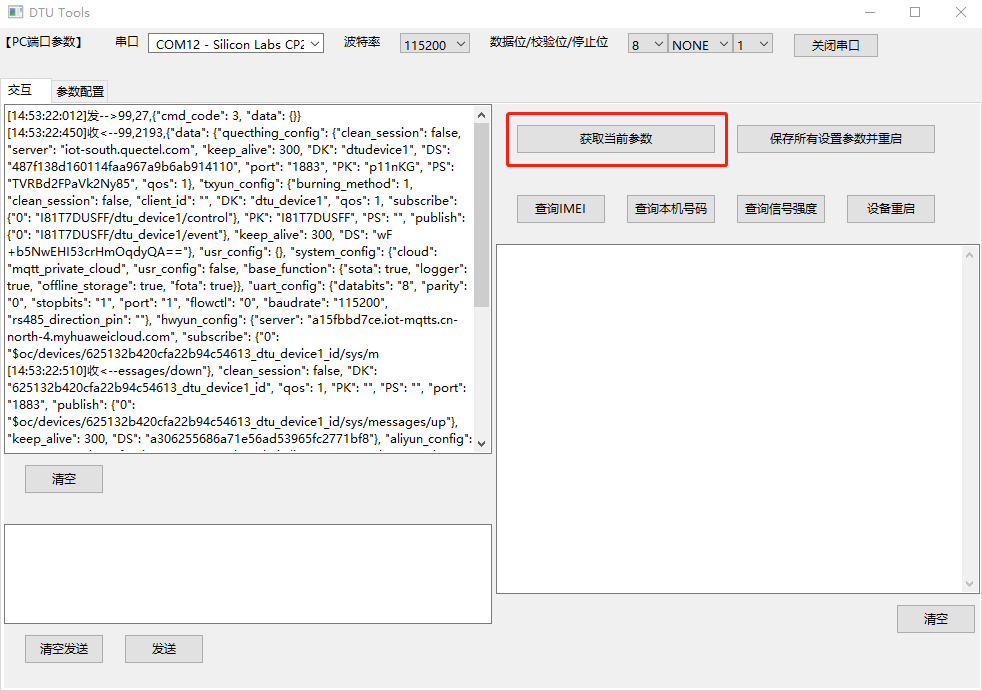
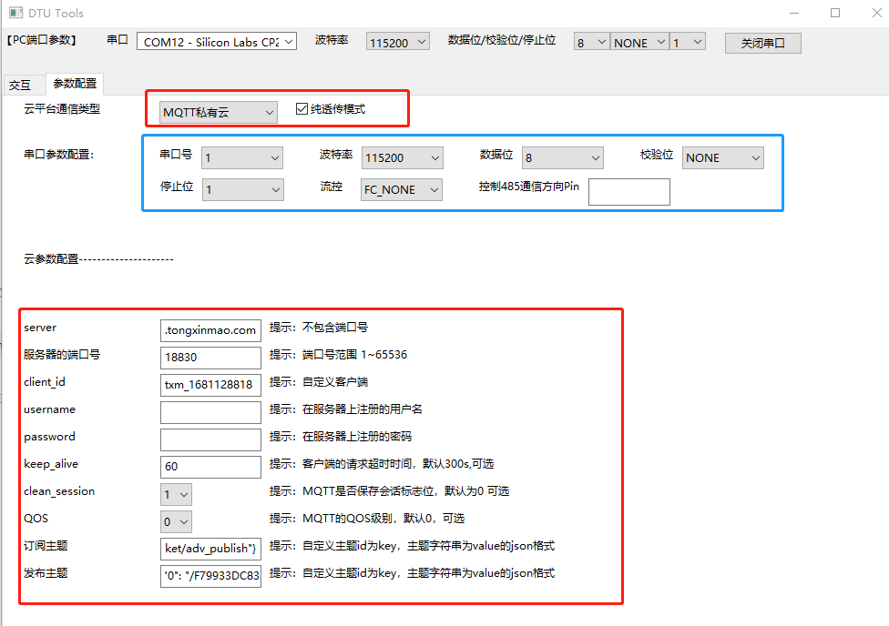
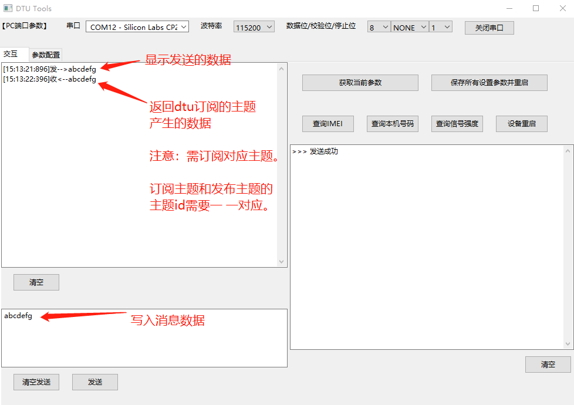
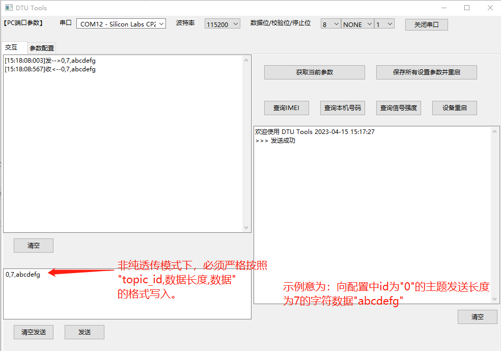

#### 1、获取初始参数

选择对于串口后，打开串口。点击“获取当前参数”按钮。

> 默认dtu软件设定`UART1`串口通信。（UART1是QuecPython串口标记，具体对应的引脚号请参阅核心版具体型号的指导说明文档。）

#### 2、参数界面配置

在选择获取当前参数后，界面会自行跳转到配置界面。如下。

> 订阅主题和发布主题：
>
> 如提示，订阅主题和发布主题，均采用"**主题id为key，主题字符串为value的json格式**"。
>
> 举例说明：参数`{"0":"/F79933DC83A4/connect_packet/adv_publish"}`，表示id为`"0"`的主题`"/F79933DC83A4/connect_packet/adv_publish"`。

#### 3、使用dtu工具转发mqtt

> 纯透传模式选项说明：
>
> 如果没勾选该选项，则我们在交互界面转发mqtt消息的时候，需严格按照`topic_id,消息长度,消息数据`格式给指定id的主题发送消息。
>
> 如果勾选该选项，则我们在交互界面转发mqtt消息的时候，只需要写入转发的原始消息数据即可，默认选择第一个主题发布。

##### 3.1、纯透传模式

##### 3.2、非纯透传模式

