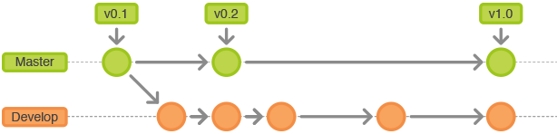

# 《GitFlow工作流介绍》

## 1、什么是"GitFlow工作流"？

`GitFlow`工作流，指的是使用`git`共同参与项目代码管理的程序员(们)所遵从的操作规范流程。常见的工作流程如：`GitFlow工作流`、`Forking工作流`、`功能分支工作流`和`集中式工作流`等。

接来下，我们主要介绍`GitFlow`工作流。

## 2、分支管理

`GitFlow`工作流贯穿整个项目生命周期，其中`master`分支和`develop`始终存在，且`master`分支被视为稳定分支，`develop`分支是相对稳定的开发分支，新增特性开发在`feature`分支上进行，`release`分支用于发布，bug修复会在`hotfix`分支上进行。

## 3、历史分支

`GitFlow`工作流采用2个分支`master`和`develop`分支来，管理项目历史。`master`记录正式版本，`develop`作为功能的集中分支。

## 4、功能分支

所有新开发的功能，都有自己的独立分支，且都是从`develop`分支取。当心功能开发完成，合并到`develop`分支。

## 3、发布分支

如下图所示，`release`分支，是从`develop`分支checkout而来，在该分支上面只做与发布有关的事，如bug修复，文档生成等。一旦发布分支任务完成，应合并到`master`分支上并打好tag。从新建发布分支以来做的所有修改都要合并回`develop`分支。

## 4、热修分支

热修分支`hotfix`是唯一一个可以直接从`master`fork出来的分支，该分支用于快速给版本打补丁。修复完成后应该立刻合并回`master`分支。

