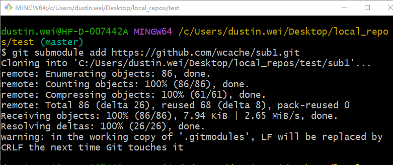
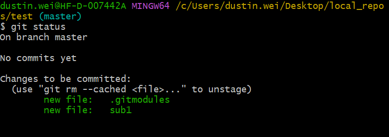
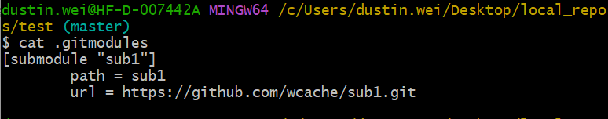
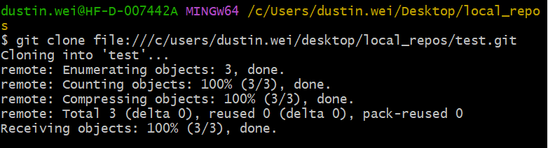
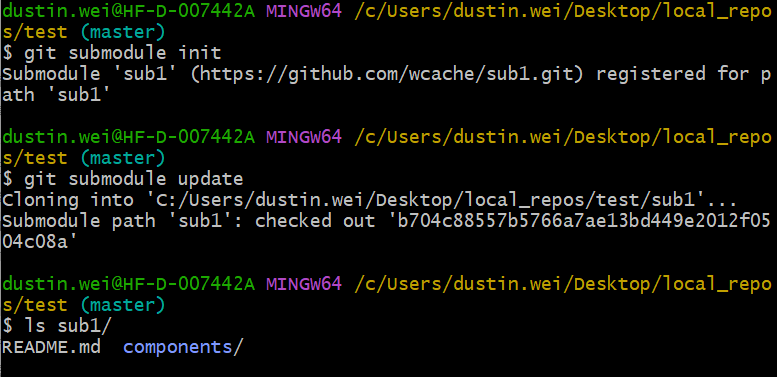

# 《GIT应用之子模块添加和克隆》

通常我们在工作过程中，需要在一个工程中**嵌套**另一个工程 —— 也许是一个依赖的第三方库或者是协同开发者开发的工程的另一部分。如此就诞生了这样的需求：你需要在一个仓库中工作，处理其他仓库且又需要保持它们之间相互独立。

`Git`使用一种叫做**submodules**的特性，来满足上述需求。

> submodules允许我们在一个仓库中嵌套另一个仓库(子目录形式存在)。这样就可以在你的仓库中clone其他仓库，且保持提交独立。

### 添加子模块

接下来，让我们在项目仓库`test`目录中，添加子仓库`https://github.com/wcache/sub1.git`。

> 命令：`git submodule add https://github.com/wcache/sub1.git`

> 默认情况下，子模块将会以 与子仓库同名目录形式存在。可以在子仓库url后面添加路径来指定子目录。

使用`git status`查看仓库当前状态。

可以看到， 我们多个`sub1`文件夹和`.gitmodules`隐藏文件。

其中，`sub1`是我们子仓库存放的目录。`.gitmodules`是当前主仓库用于记录跟踪子仓库的文件，如下图：

> 标签**[submodule "sub1"]**表明一个跟踪的子仓库，`path`为存储路径，`url`为子仓库地址。

注意，此时我们仅仅在本地仓库添加了一个子仓库，在主仓库没有新提交之前，其他的协同开发者，是我法获取子仓库的。

> 我们需要将添加子仓库后的变更，在主仓库中新提交。
>
> `git add .`
>
> `git commit -m 'add sub1'`
>
> `git push origin master`

### 克隆一个带有子模块的仓库

当我们另一位开发者，clone仓库之后，发现子仓库目录`sub1`为空。

这个时候，我们需要2个步骤来初始化子仓库。

- `git submodule init`
- `git submodule update`

