### 一、前言

本文只介绍阿里云OTA升级相关内容，包括阿里云控制台配置以及基于QuecPython的设备端升级服务开发。

### 二、OTA升级概述

物联网平台提供OTA升级与管理服务，使用该服务首先要确保设备端支持OTA服务，然后在物联网平台控制台的OTA升级页面，上传新的升级包并指定需要升级的设备。物联网平台推送OTA升级消息给设备，设备即可下载OTA升级包，并进行OTA升级。本文主要介绍阿里云OTA升级的使用和操作流程。 

> 阿里云物联网平台控制台：https://iot.console.aliyun.com/lk/summary/new
>
> 设备端OTA服务开发以QuecPython平台的OTA升级为例，api参考地址：https://python.quectel.com/doc/API_reference/zh/QuecPython_classlib/fota.html）

**OTA升级基本流程**：

1. 设备上报版本号。
2. 设备订阅OTA相关Topic。
3. 在OTA后台配置OTA任务，可以按多纬度知道要升级的设备。
4. 成功订阅OTA相关Topic的设备在当前配置的OTA任务中，设备会收到一个推送信息，其中包括：
   1. 可升级的版本号。
   2. 固件地址、大小、MD5。
5. 下载固件，开始升级，并上报升级进度。
6. 升级完成后，自动上报新的版本号，整个OTA流程结束。

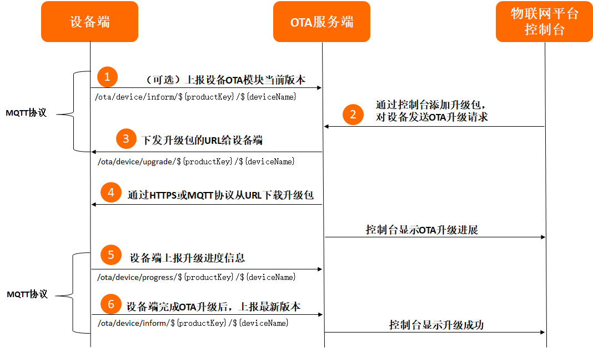

### 三、阿里云物联网平台配置

#### 1、注册账号并登录控制台

支付宝、钉钉账号均可登录。略。

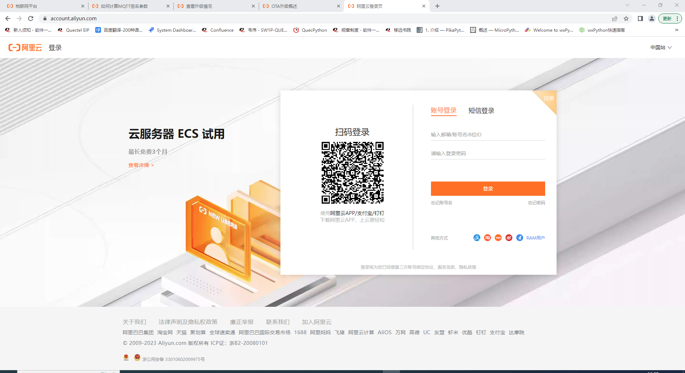

#### 2、购买实例

如下图，实例为` iot-060a3cz6 `

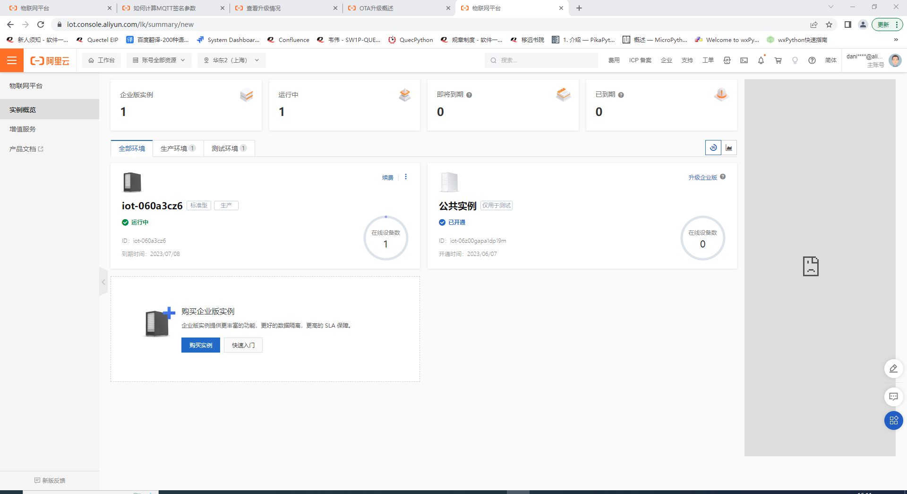

点击实例名，进入实例详情页。

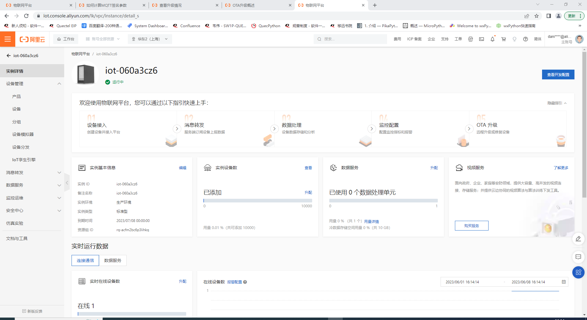

#### 3、创建产品

点击左侧菜单栏`设备管理 --> 产品`。

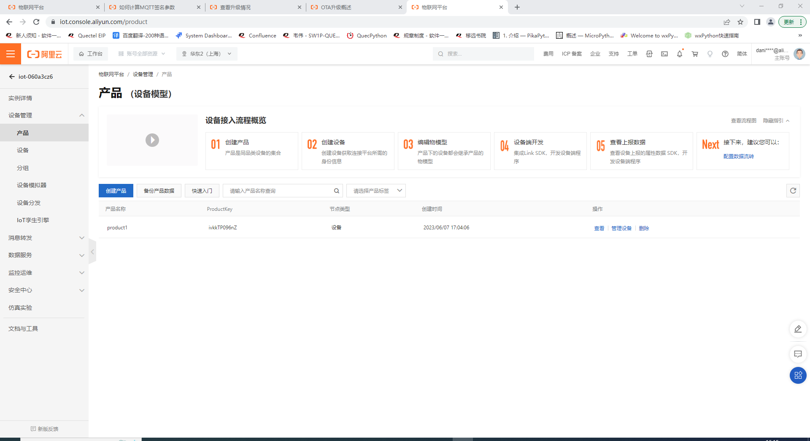

点击按钮**创建产品**，如下图填入参数。

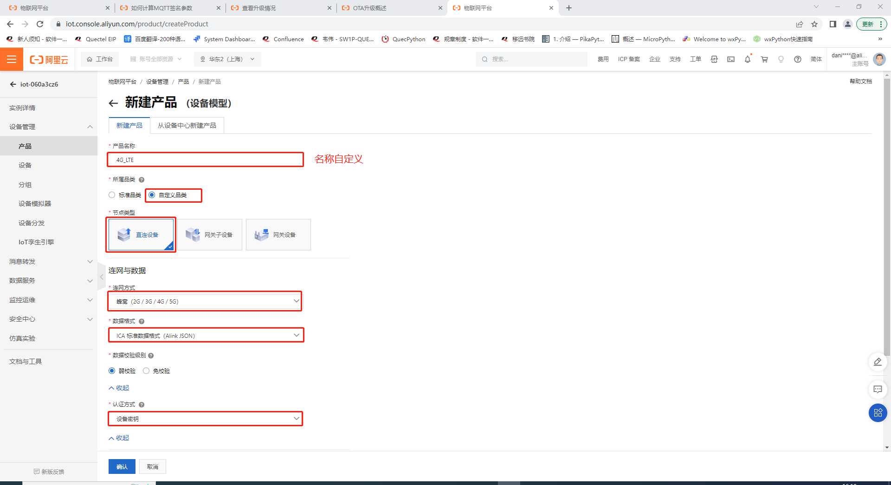

#### 4、添加设备

点击左侧菜单栏`设备管理 --> 设备`。

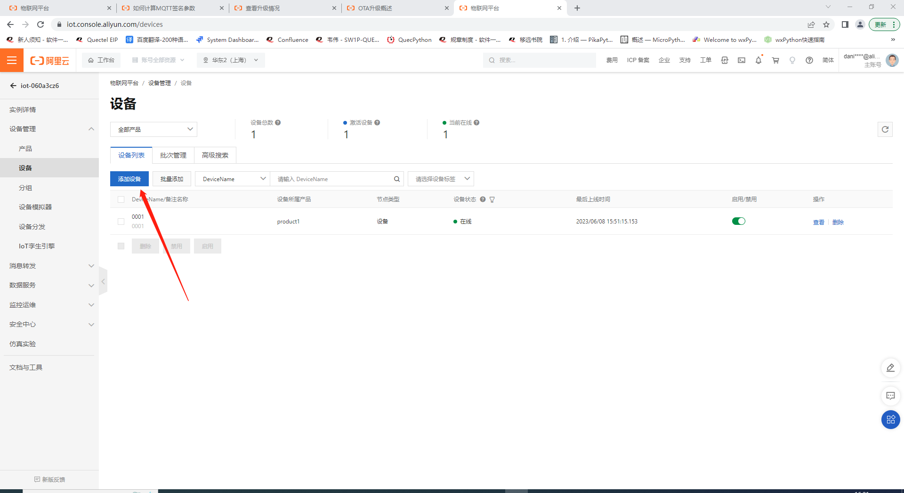点击按钮**添加设备**，如下图填入参数。

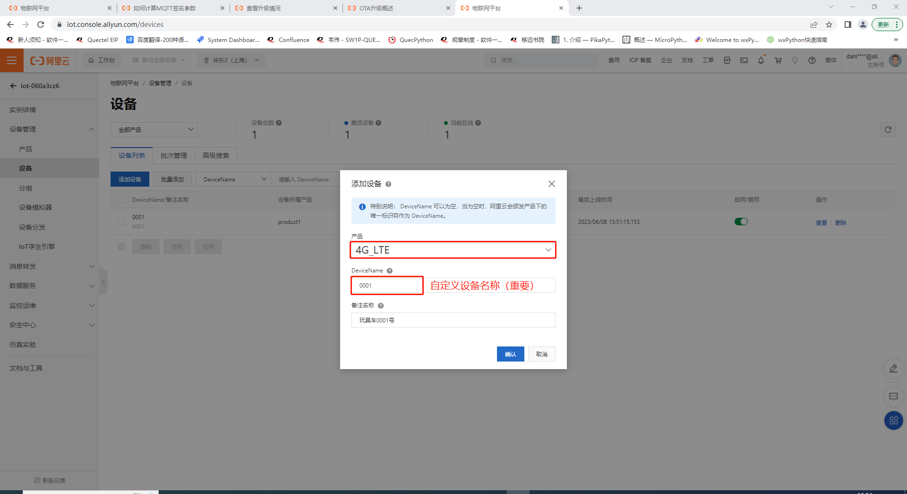

#### 5、获取MQTT连接参数

创建设备后，点击设备列表中的**查看**按钮进入设备详情页。

设备参数

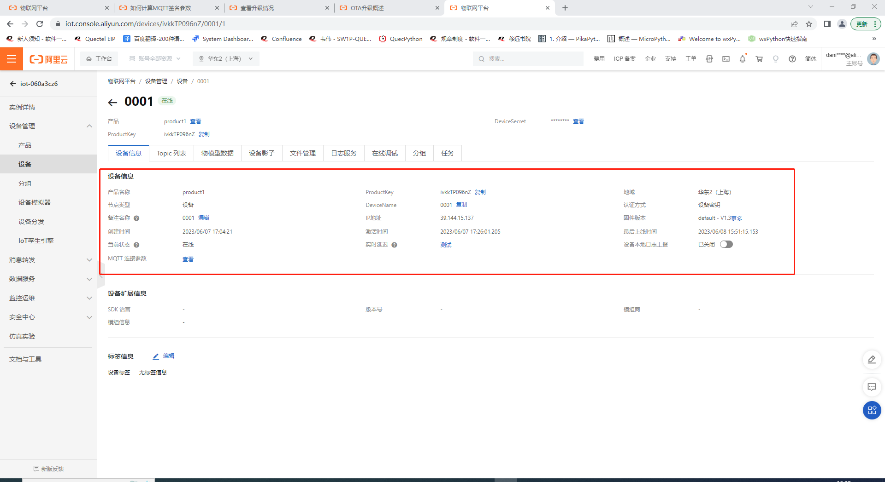

mqtt连接参数

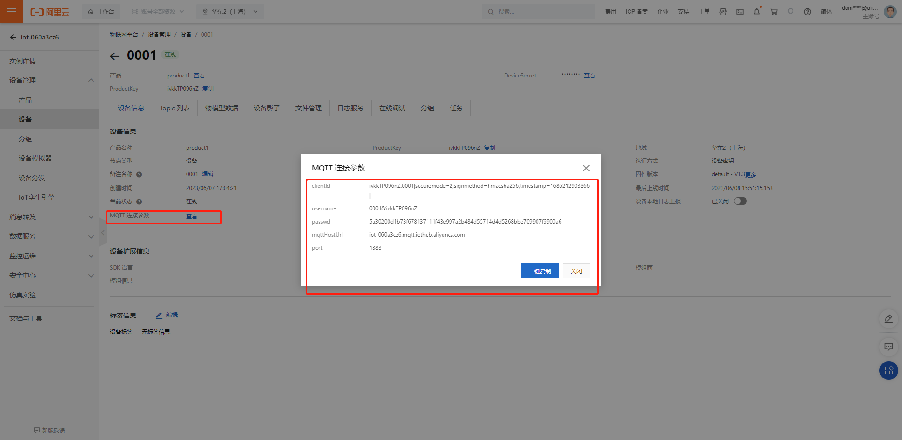

### 四、设备端OTA服务开发

> 基于移远QuecPython模组开发。

#### 1、参数配置

将阿里云物联网控制台中获取的参数写入配置文件，如下。

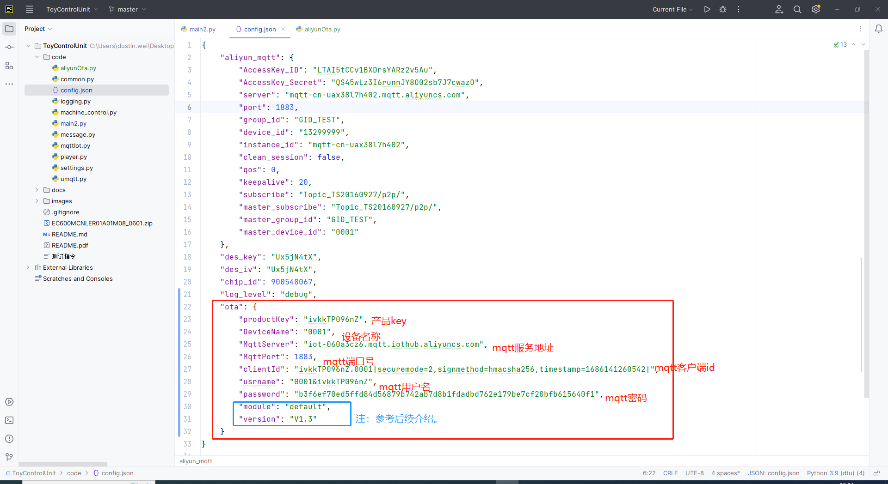

`module`与`version`参数介绍，`module`意为模块，`version`意为版本。阿里云OTA在添加升级包的时候，需要设置该升级包的模块和版本号。如果设备固件版本不属于该模块，那么是无法推送升级的。下入为添加OTA升级的模块。

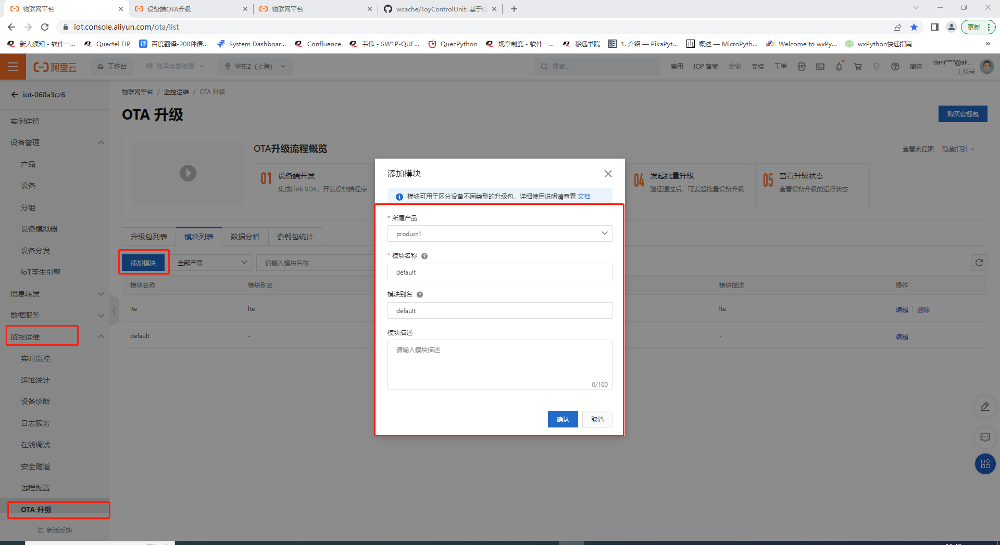

> 设备上报固件版本时候需同时上报模块名称与版本号。

#### 2、设备OTA服务线程

> 模块上电即上报一次模块当前版本号（即配置文件中`ota.module`与`ota.version`字段）。

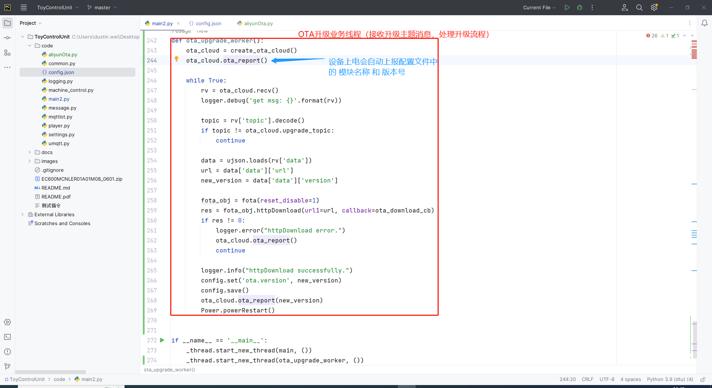

### 五、添加升级包，发送OTA升级请求

#### 1、添加升级包

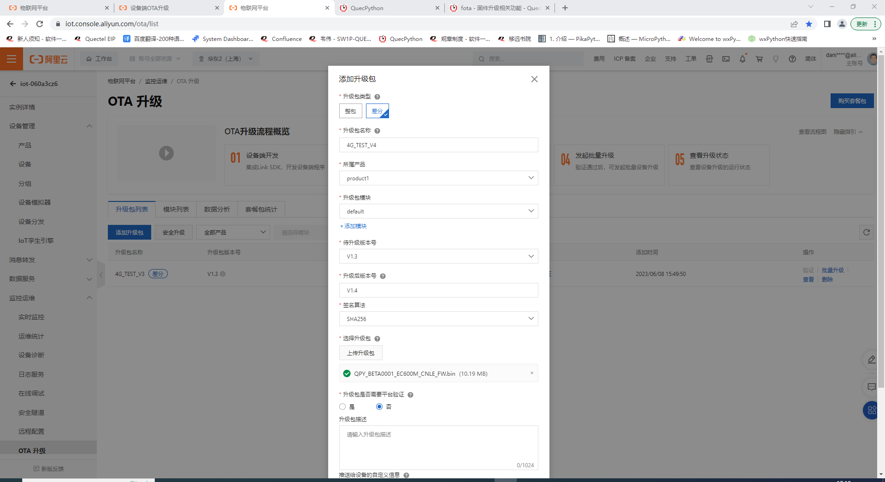上图为例：

所属产品：即为一开始创建的产品（一个产品下属多个设备）。

升级包模块：即为前序步骤创建的模块（模块+版本号是升级包和设备固件版本的唯一标识）。

待升级版本号：设备当前版本号。

升级后的版本号：新版本号。

> 假设升级包模块为`default`，待升级版本号为`V1.3`。升级后的版本号为`V1.4`。那么，只有当前模块为`default`且版本号为`V1.3`的设备，才会收到升级推送，升级成功之后，模块应记录并上报新版本号`V1.4`。

####  2、发起升级推送

点击升级包列表右侧**批量升级**按钮。

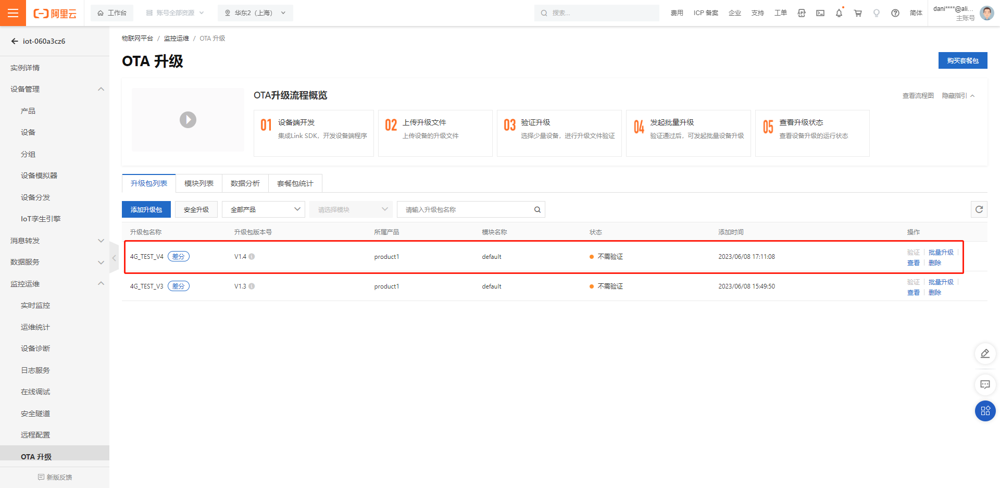

选择升级配置

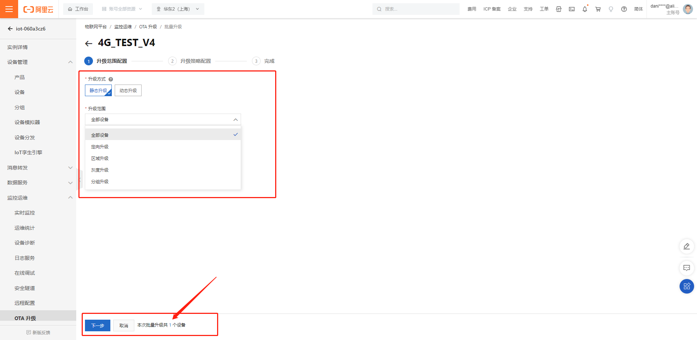

> 当前显示只有一个设备可升级，因为我的环境中只有一个设备是`default`模块且版本号为`V1.3`。

选择升级策略。根据实际需求选择即可。点击**完成**发起升级推送。

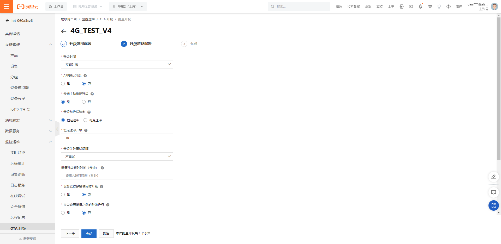

详情页中可以查看升级状态。此时设备如果在线，会受到升级推送主题消息，携带升级固件文件下载url，由固件进入下载升级流程，完成升级后上报状态（包含新版本号）后，控制台显示升级成功、失败（如果上报版本号为升级后版本号则成功，若未就版本号则失败）。

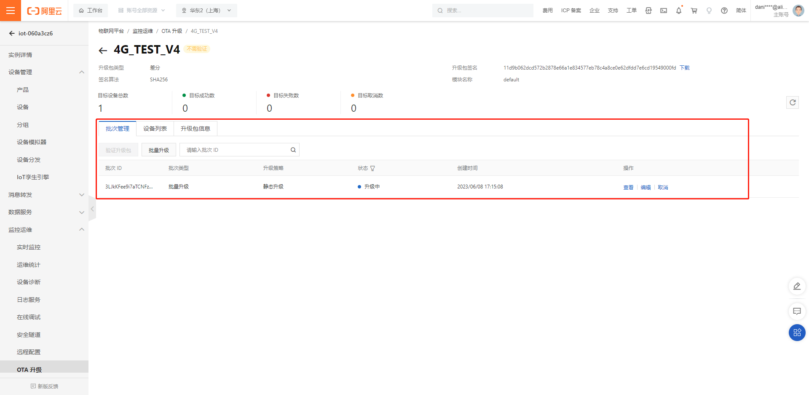