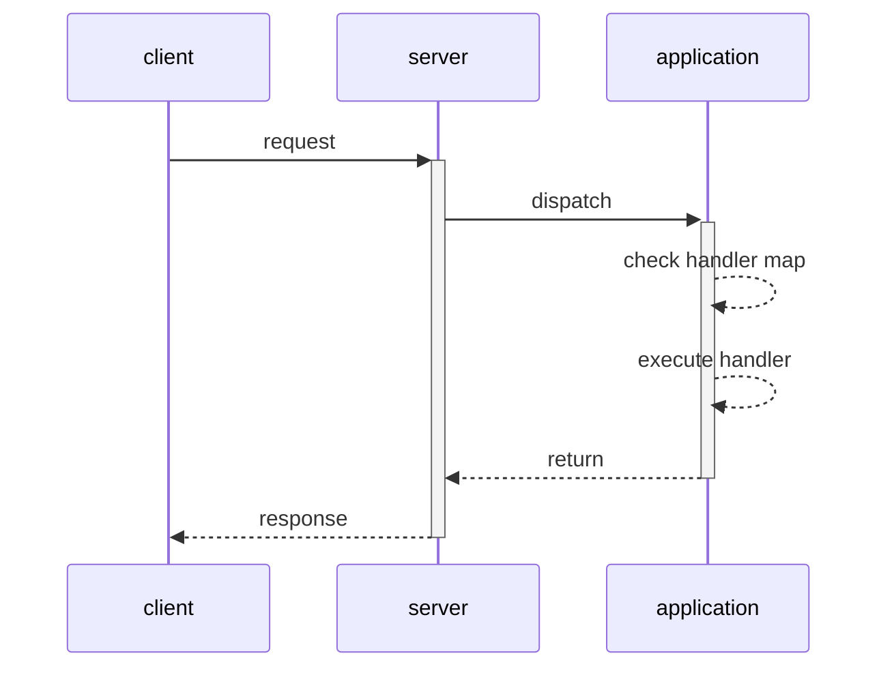
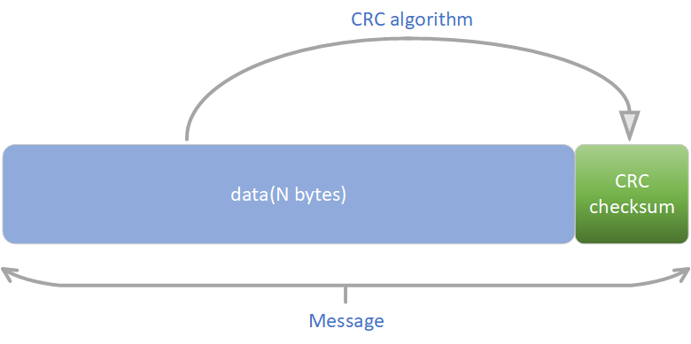
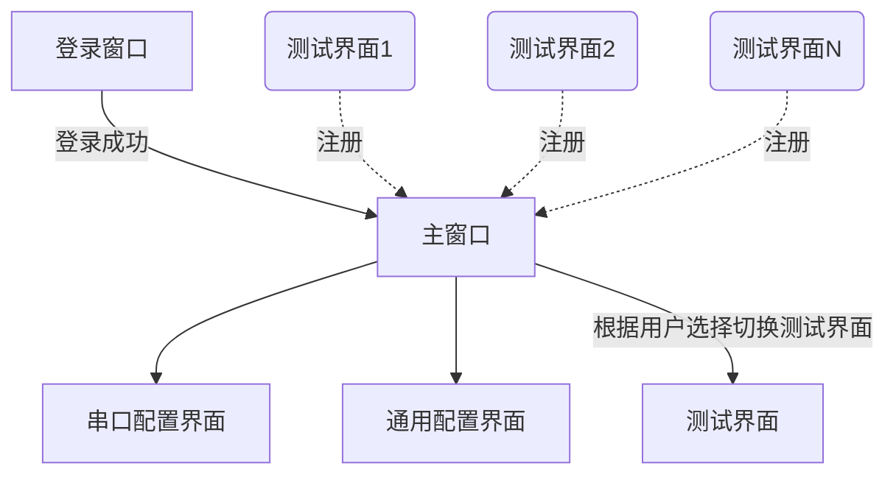

# 《多通道继电器自动化测试工具指导文档》

author : Dustin.Wei (dustin.wei@quectel.com)

version : 1.0

date:2023-03-14 08:14:41

copyright : Copyright (c) 2022

## 一、模组框架设计

### 1、目录结构

```txt
QuecTestModule
|-- application.py	模组应用 
|-- config.py	配置文件（用户新建测试模块，需在配置文件中注册）
|-- crc.py		crc校验
|-- exceptions.py	异常     
|-- frame.py	协议帧   
|-- main.py		主入口  
|-- server.py	主服务      
|-- status.py	状态码  
|-- uart.py		基于machine.UART的同步读接口封装
`-- testVI.py	用户自定义测试模块
```

### 2、应用对象

在`application.py`中定义`App`类，该类实现了**任务注册**、**任务分发**。

#### 2.1、任务注册

假设我们需要定义一个测试模块`testVI.py`，内部定义函数(供上位机调用)，如下。

```python
from application import app

# 注册testVI任务函数，指定任务名称为'VI'，注意该名称不可重复。
@app.task('VI')
def testVI(board, channel):
    """
    @param board: 板号
    @param channel: 待测模组通道号
    @return: dict, voltage and current, custom defined
    """
    # TODO: do test case
    pass
```

在定义好任务模块之后，需要在`config.py`中注册才能生效，如下：

```python
# 测试模块导入路径列表，所有自定义测试模块，都需要加入该列表
TEST_MODULE_LIST = [
    'usr.testVI',
]

```

完成上述3.1步骤，即表示测试模块注册完毕，上位机即可使用`rpc`通信包远程调用该任务函数，见上位机框架设计。

> 上位机调用方式: `rv = caller.callTask('VI', args=(1, 233))`

#### 2.2、任务分发

任务分发是应用服务自行处理，用户无需操作。这里，简单介绍下分发逻辑。

`App`中定义一个`self.handler_map = {}`映射字典，key即为`app.task`指定的任务名，value为任务函数对象。在接收到上位机请求后，会根据请求中的task名称，在该字典中查找任务，找到则调用，找不到则返回异常。




### 3、协议帧

在`frame.py`中定义了请求和响应对象封装以及帧报文构建方法。

> `frame.py`模块是上位机和模组通用模块，用于构造请求和响应报文。

#### 3.1、请求对象

```python
>>> from rpc.frame import Request
>>> # 构造请求对象，位置参数1为任务名称，args和kwargs为任务函数位置参数和关键字参数
>>> request = Request('testVI', args=(1,2), kwargs={'channel': 1})
>>> # 请求对象dump为帧报文(字节数组)
>>> request.dump()
bytearray(b'at={"task": "testVI", "args": [1, 2], "kwargs": {"channel": 1}}\x15')
>>> # 帧报文load为请求对象
>>> request = Request.load(bytearray(b'at={"task": "testVI", "args": [1, 2], "kwargs": {"channel": 1}}\x15'))
>>> request.task, request.args, request.kwargs
('testVI', (1, 2), {'channel': 1})
```

#### 3.2、响应对象

```python
>>> from rpc.frame import Response
>>> from rpc import status
>>> # 构造响应对象， status为状态码，message为提示信息，data为任务函数返回值
>>> response = Response(status=status.OK, message='', data={'x': 1, 'y': 2})
>>> # 响应对象dump为帧报文(字节数组)
>>> response.dump()
bytearray(b'at9{"status": 200, "message": "", "data": {"x": 1, "y": 2}}\xa9')
>>> # 帧报文load为响应对象
>>> response = Response.load(bytearray(b'at9{"status": 200, "message": "", "data": {"x": 1, "y": 2}}\xa9'))
>>> response.status, response.message, response.data
(200, '', {'x': 1, 'y': 2})
```

#### 3.3、帧结构

以帧报文`b'at={"task": "testVI", "args": [1, 2], "kwargs": {"channel": 1}}\x15'`为例子。结构如下：

| 帧头(2bytes) | 信息长度(1byte) | 信息(N bytes，用户数据经json编码，编码方式为UTF8)            | CRC校验码(1byte) |
| ------------ | --------------- | ------------------------------------------------------------ | ---------------- |
| b'\x61\x74'  | b'\x3d'         | b'{"task": "testVI", "args": [1, 2], "kwargs": {"channel": 1}}' | b'\x15'          |

#### 3.4、CRC校验



采用单字节校验码，采用查表法计算。单字节crc值计算算法如下：

```python
def cal_crc_perbyte(rawbyte, poly=0x07):
    """
    单字节冗余计算
    @param rawbyte: int, 0~255
    @param poly: int, crc多项式
    @return: crc校验码(单字节, 整数)
    """
    crc = rawbyte
    for _ in range(8):  # 每个字节冗余计算，共8次
        if crc & 0x80:
            crc = (crc << 1) ^ poly
        else:
            crc <<= 1
    return crc & 0xFF  # 最终结果取单低位一个字节
```

> 参考`crc.py`模块实现。

### 4、模组通信

协议与上位机一致，唯一不同的是模组通信使用`machine.UART`串口通信模块，这里封装了`UART.read`接口，实现阻塞式同步读，见`uart.py`如下。

```python
class UARTControl(object):
    
    def write(self, data):
        # write bytes data
        # ...

    def read(self, nbytes, timeout=0):
        """
        if read enough bytes within blocking mode, it will return immediately.
        raise TimeOutError error if timeout, but we still get no enough bytes.
        @param nbytes: int, N bytes you want to read
        @param timeout: int, ms
                        0 for no blocking
                        <0 for blocking forever
                        >0 for blocking until timeout.
        @return: bytes actually read.
        """
        # ....
```

## 二、上位机框架设计

### 1、目录结构

```text
QuecTestGUI
|-- logic	业务逻辑层
|   |-- __init__.py
|   |-- base.py	逻辑层任务线程基类
|   `-- ... 其他用户定义业务模块
|-- main.py	主入口
|-- rpc	通信层
|   |-- __init__.py
|   |-- api.py	用户接口
|   |-- crc.py	crc校验
|   |-- exceptions.py	异常
|   |-- frame.py	协议帧(请求、响应)
|   `-- status.py	状态码
|-- sources	资源
|-- ui	界面
	|-- components	界面组件
    	|-- __init__.py
    	|-- base.py	窗口基类(包含matlab界面类)
    	|-- com.py	串口配置界面
    	|-- general.py	通用配置界面
    	|-- decimalctrl.py	Decimal文本输入控件
    	|-- mpl.py	matlab绘图界面
    	|-- timer	定时器组件
    	|-- vi.py	VI测试界面
    	|-- ipd.py	阻抗测试界面
    |-- exceptions.py	异常
    |-- login.py	登录界面
    |-- main_win.py	主窗口
    `-- ...	其他用户定义界面
|-- utils	工具集
	`-- smu.py	基于pyvisa封装的SMU通信组件
|-- main.py	主入口
|-- build.sh	编译脚本
```

### 2、RPC通信层介绍

借助于RPC设计思想，本项目中将**对用户屏蔽底层通信细节**。对于用户而言，调用模组的**任务函数**直观感受就像是调用了一个本地函数，对通信细节无感知。

#### 2.1、快速上手

> 需运行模组服务，且模组中必须已经定义任务。参考模组框架设计。

在`rpc/api.py`中定义了用户接口，下面介绍具体使用方式：

```python
>>> from rpc.api import TaskCaller
>>> # 实例化TaskCaller对象，见名知意，它是一个用于远程调用任务的对象。
>>> caller = TaskCaller()
>>> # open函数打开串口，开放配置，用户可根据实际情况设置
>>> caller.open({
    'port': 'COM12', 
    'baudrate': 115200, 
    'bytesize': 8, 
    'parity': 'N', 
    'stopbits': 1
})
>>> # 检测串口是否已经打开
>>> caller.isOpen()
True
>>> # callTask有参数参数: callTask(task, args=(), kwargs={}), 其中，task是任务名称(注意不一定是函数名称，在模组中是自定义的)，args和kwargs分别是调用任务函数的位置参数和关键字参数
>>> rv = caller.callTask('VI', args=(1, 233), kwargs={}) # 返回值即为任务函数的返回值，建议是一个字典且json可序列化
>>> # 注意：关于任务函数的定义，详见模组框架设计
```

#### 2.2、协议帧

参考模组框架设计`3、协议帧`。

#### 2.3、用户接口

模块`frame/api.py`中定义`TaskCaller`类，该类基于`pyserial`封装串口通信接口，配合自定义协议，实现通信。下面详细说明该类的具体使用。

```python
class TaskCaller(builtins.object)
 |  Methods defined here:
 |  
 |  __init__(self)
 |      self._serial: 串口通信对象，SerialClass Object，默认是serial.Serial
 |      self._options: 用于保存可选串口配置参数
 |  
 |  callTask(self, task, args=(), kwargs=None)
 |      call remote task with position and keyword arguments.
 |      @param task: str, task name
 |      @param args: position arguments
 |      @param kwargs: keyword arguments
 |      @return: the return value of remote task
 |  
 |  close(self)
 |      close Port
 |  
 |  isOpen(self)
 |      @return: True if Serial Object exists and open successfully else False
 |  
 |  open(self, config)
 |      open com port.
 |      @type config: dict, with same kwargs as SerialClass
 |      @return: None
 |  
 |  recv(self)
 |      recv protocol frame message, bytes type, you should never use it directly.
 |      @return: Response Object
 |      @raise RPCReadError: if something wrong when reading COM Port
 |  
 |  send(self, request)
 |      send protocol frame message, bytes type, you should never use it directly.
 |      @param request: Request Object
 |      @return: None
 |      @raise RPCWriteError: if something wrong when writing COM Port
 |  
 |  ----------------------------------------------------------------------
 |  Readonly properties defined here:
 |  
 |  options
 |      基于SerialClass的可选串口配置参数
 |  
 |  serial
 |      获取串口通信对象
 |      @raise PortOpenError: if port not open raise PortOpenError.
 |      @return: SerialClass Object
 |  
 |  ----------------------------------------------------------------------
 |  Data and other attributes defined here:
 |  
 |  SerialClass = <class 'serial.serialwin32.Serial'>
 |      Serial port implementation for Win32 based on ctypes.
```

### 3、逻辑层

逻辑层处于GUI和RPC通信之间，用于接收GUI用户输入参数，调用RPC用户接口与模组通信，并完成具体的业务处理。

通常，简单的任务，我们在GUI事件函数中就可以直接处理。但是对于复杂的任务，或者要求任务处理过程中需要与GUI交互实现实时渲染，比如我们在GUI中触发一个事件（可以是开始按钮点击事件，启动测试任务），就需要开启一个独立的**工作线程**来完成具体的任务，实现与GUI的解耦，不阻塞UI。

所以，在`logic/base.py`中，提供了一个**工作线程基类**`WorkThread`。

#### 3.1、快速上手

定义测试任务工作线程在模块`logic/vi.py`中。

```python
from .base import WorkThread

class VIWorkThread(WorkThread):
    def execute(self):
        # TODO: 测试业务代码编写
        pass
```

假设我们在GUI窗口的一个事件处理函数中，开启一个工作线程。

```python
import wx
from logic.vi import VIWorkThread
from ui.components.base import BasePanel

class CustomPanel(BasePanel):
    def __init__(self, *args, **kwargs):
        self.button = wx.Button(self, label='开始测试')
        self.Bind(wx.EVT_BUTTON, self.handler, self.button)
    
    def handler(self, event):
        # TODO: 此处我们需要开启任务工作线程来开启测试任务
        self.thread = VIWorkThread(self)  # 用户需继承WorkThread重写execute方法实现业务
        self.thread.setPostHandler(self.threadPostHandler)
        self.thread.setErrorHandler(self.threadErrorHandler)
        self.thread.setFinishHandler(self.threadFinishHandler)
        self.thread.start()
        
    def threadPostHandler(self, data):
        """
        接收工作线程数据并处理
        @param data: 用户数据
        @return:
        """
        pass
    
    def threadErrorHandler(self, exc):
        """
        工作线程异常处理函数
        @param exc: 异常对象
        @return:
        """
        pass
    
    def threadFinishHandler(self, result):
        """
        工作线程结束并完成工作后的回调
        @param result: 线程执行结果返回值
        @return:
        """
        pass
```

如上，`WorkThread(win, context)`构造函数接收两个参数，`win`参数为当前GUI窗口对象(通常是`Window`对象)，`context`参数是任务处理需要使用上下文(该参数会被保存在工作线程对象的`context`属性中，以供任务处理过程中需要)。

另外，该线程提供了三种方式与窗口通信，分别是:

- `setPostHandler(handler)`，绑定一个函数`hander(data)`，该函数有唯一参数`data`。在线程中使用`self.post(data)`方法可触发该`handler`的调用，`post`方法的参数`data`即为`handler`实际接收的参数。
- `setErrorHandler(handler)`，绑定一个函数`handler(exc)`，该函数有唯一参数`exc`(线程触发的异常对象)。当线程抛出异常后会调用该`handler`。
- `setFinishHandler(handler)`，绑定一个函数`handler(result)`，该函数有唯一参数`result`(`WorkThread.execute`方法的返回值)。当线程任务执行结束后会调用该`handler`。

#### 3.2、任务工作线程基类介绍

```txt
class WorkThread(BaseThread, metaclass=_BaseMetaClass)
 |  WorkThread(win, data=None, **kwargs)
 |  
 |  Method resolution order:
 |      WorkThread
 |      BaseThread
 |      threading.Thread
 |      builtins.object
 |  
 |  Methods defined here:
 |  
 |  __init__(self, win, data=None, **kwargs)
 |      @param win: the wxPython GUI Window Object
 |      @param data: user data（parameters for task）
 |      @param kwargs: deliver this to threading.Thread.__init__
 |  
 |  bind(self, handler)
 |      bind Event to self.win with a `handler`
 |      @param handler: callable, a wxPython GUI Event handler. usually be a method of self.win
 |      @return: None
 |  
 |  post(self, data)
 |      post an Event with data to self.win, will be handled by `handler` we bind.
 |      @param data: user data
 |      @return: None
 |  
 |  run(self)
 |      Method representing the thread's activity.
 |      
 |      You may override this method in a subclass. The standard run() method
 |      invokes the callable object passed to the object's constructor as the
 |      target argument, if any, with sequential and keyword arguments taken
 |      from the args and kwargs arguments, respectively.
```

我们在定义自己的工作线程的时候，只需要继承`WorkThread`并重写`execute`方法实现业务逻辑即可，如下:

```python
from logic.base import WorkThread

class VITestThread(WorkThread):
    
    def execute(self):
        for i in range(1000):  # test 1000 times
            if self.wait():
                # self.wait() call will block. in this method we check thread status(stop|pausing). if thread stop(call self.stop()) self.wait() will return True, if thread is pausing(call self.pause()) self.wait() will block until we call self.resume(). 
                break
            # TODO: do anthing
            # ...
            self.post({'data': 'some data send to GUI(self.win)'})
```

#### 3.3、`BaseThread`介绍

> `BaseThread`线程主要提供了线程开始、停止和暂停的功能。
>
> 通过在线程任务函数`execute`中调用`self.wait`来触发判定。见`BaseThread`具体实现。

```txt
class BaseThread(threading.Thread)
 |  BaseThread(**kw)
 |  
 |  Method resolution order:
 |      BaseThread
 |      threading.Thread
 |      builtins.object
 |  
 |  Methods defined here:
 |  
 |  __init__(self, **kw)
 |      @param kw: deliver to threading.Thread.__init__
 |  
 |  isAlive(self)
 |      return True if thread alive else False
 |  
 |  isPausing(self)
 |      pause thread(just set self.run_flag)
 |  
 |  isStop(self)
 |      return Ture if self.stop_flag is set else False
 |  
 |  pause(self)
 |      pause the thread(just clear self.run_flag)
 |  
 |  resume(self)
 |      resume the thread to continue(just set self.run_flag)
 |  
 |  start(self)
 |      start thread to run
 |  
 |  stop(self)
 |      stop thread(just set self.stop_flag, not kill it.)
 |  
 |  wait(self)
 |      check status(stop or pausing).
 |      and return True if stop else block(if self.pause()) until thread continue(self.resume()
```

#### 3.4、元类`_BaseMetaClass`介绍

该元类被指定为`WorkThread`基类的元类，旨在用户继承`WorkThread`自定义工作线程类的时候，在每个类中构建基于`wxPython`的事件对象`RESULT`和绑定对象`EVT_RESULT`，这两个对象是以类属性形式存在，用于GUI交互通信使用，用户无需关注。

> 事件对象和绑定对象使用`wx.lib.newevent.NewEvent`函数生成。关于wxPython事件，请查询官方文档。

### 4、UI设计

GUI采用wxPython接口实现，采用单窗口形式，通过动态控制`Panel`的隐藏与展示实现业务界面的切换。



#### 4.1、自制测试界面并注册


整个app界面分为三个部分，如上图所示：**串口配置窗口**、**通用配置窗口**和**测试窗口**。

其中，**测试窗口**可以根据实际需要，自定义并注册进整个界面，我们通过通用配置窗口中的`TestItem`选择框选择具体的测试项目，展示该测试窗口并测试。

下面，我们简单说明，如何新增一个测试窗口并注册。

##### 4.1.1、自定义测试窗口(一个`wx.Panel`类)

继承在窗口基类`ui.components.BasePanel`。并添加需要的控件。

> 界面使用wxPython框架编写，参阅https://www.wxpython.org/。

##### 4.1.2、在主窗口类中注册

将编写好的测试窗口Panel类对象，添加进`MainWindow.getPanels`返回列表即可。

```python
class MainWindow(wx.Frame):
    
    # ...
    
    def getPanels(self):
        """
        获取用户自定义测试界面Panel类对象，返回一个列表。
        列表中的所有测试Panel都会被注册进主窗口
        """
        return [
            VIPanel(self, name='VI曲线测试'),
            IpdPanel(self, name='阻抗测试')
        ]
    
    def registerPanels(self):
        panels = self.getPanels()
        for panel in panels:
            panel.Hide()
            self.name2item_map.update({panel.GetName(): panel})
            self.item_box.Add(panel, 1, wx.ALL | wx.EXPAND, 0)
```

#### 4.2、界面展示

##### 4.2.1、登录框

 

##### 4.2.2、VI测试窗口


##### 4.2.3、阻抗测试窗口


##### 4.2.4、GPIO驱动测试窗口

待补充。
