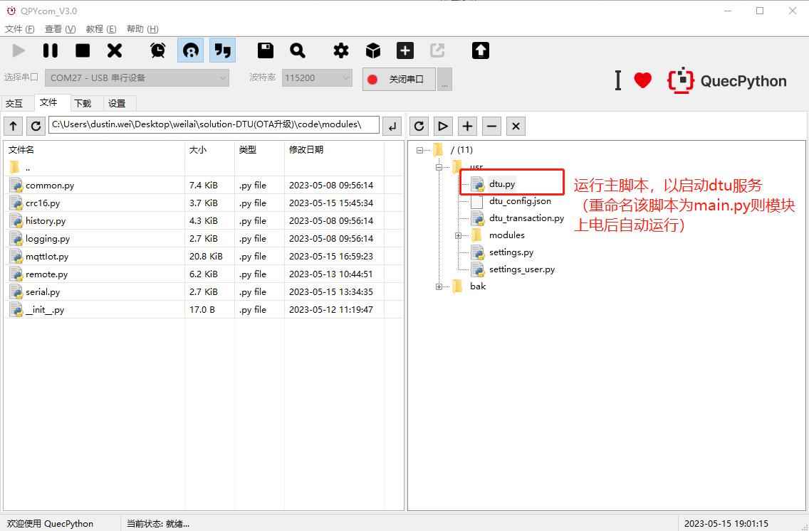
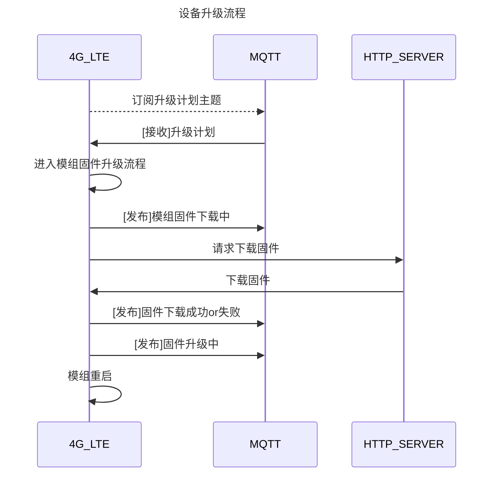
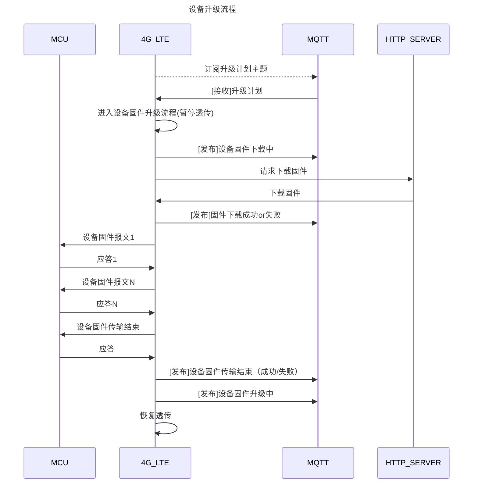

### 1、模组调试

#### 1.1、导入代码

#### 1.2、启动服务主脚本

### 2、升级相关主题

升级计划主题前缀： **/ota/device/upgrade/**
升级状态报告主题前缀： **/ota/upgrade/status/**

完整主题格式：主题前缀 + <client_id>

例如：

升级主题前缀为**"/ota/device/upgrade/"**

client_id为**"txm_1682300808"**

则完胜订阅升级计划的主题为**"/ota/device/upgrade/txm_1682300808"**

### 3、设备升级流程

> 4G模组在接收到升级计划后，即刻进入升级阶段。
>
>  透传数据中会包含设备和云端 之间关于模组固件升级的协商流程 。
>
> - 设备可一直保持透传模式
> - 等待模组固件升级结束后，会向云 端报告结果，并订阅透传主题
> - 设备可继续透传业务  

### 4、模组升级流程

> 1. 透传数据是单独线程处理，在接收升级计划后，设备固件下载前，会退出透传数据线程（暂停透传）。
> 2. 若本次升级固件url和上一次一致，且固件文件已下载。则不会重新下载，直接进入升级流程。
> 3. 设备固件升级url和固件文件，会分别保存本地文件`/usr/mcu_upgrade_url.txt`，`/usr/mcu_upgrade_file.bin`。
> 4. 检测固件文件crc32校验值。文件crc32校验算法，参阅代码`utils_crc32.c`。如果校验失败，则会删除url文件和固件文件。
> 5. 进入固件传输流程。报文参阅《未来先生DTU_V2.1.pdf》
>    1. 固件文件按照1024字节读取并构建一个数据包发送。
>    2. 每个数据包的发送，最多尝试三次，每次间隔20s。
>    3. 再未得到正确应答，尝试发送次数超过3次，则认为升级失败。
>    4. 报文crc16校验码生成算法参考`crc16.py`。
>    5. 应答报文可不携带参数（长度设为0即可）。
> 6. 发布升级状态（成功 或 失败）
> 7. 重启数据透传线程（恢复透传）。

# 记录

> Q: 
>
> 我试了一下韦工发过来的最新固件已经能做透传，但目前来说有几个问题需要沟通一下：1、上次说的1拖8的固件烧写软件是不是我们只用烧写我们应用层的那部分内容即可（你们发给我们的EC800E-CN模块应该是共有的固件）；2、刚才我试了就单个烧写来说有个问题就是需要将每个4G模块的BOOT管脚接地才能用QFlash烧写，这个后期1拖8的话怎么解决？谢谢
>
> 
>
> A:
>
> 1. 我们模组出厂时标准固件，需要您这边重新烧录包含您应用的完整固件
> 2. 对于800E模组来说，目前只能将boot引脚接地来实现固件烧录，工厂批量生产的话，只能通过夹具实现，不是烧录软件能解决的
> 3. 在夹具上，通过顶针将boot接地，然后在1拖8烧录

