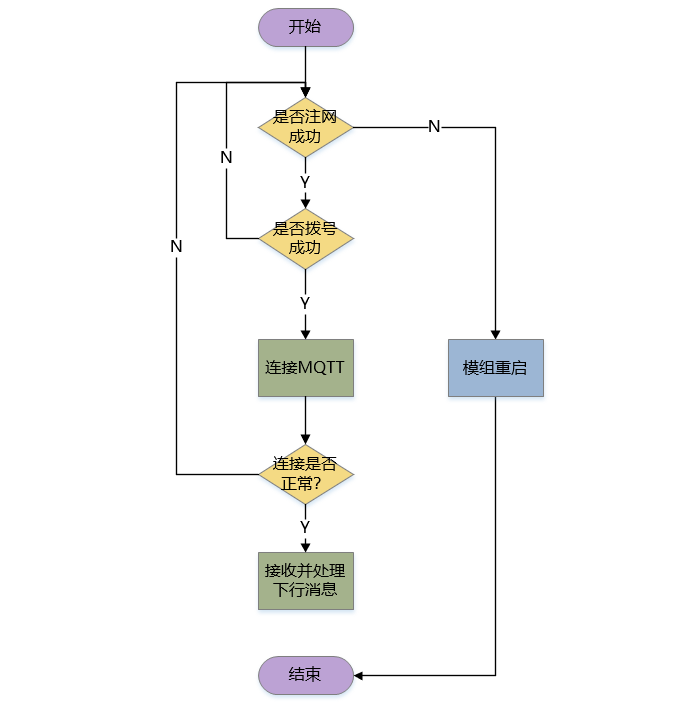
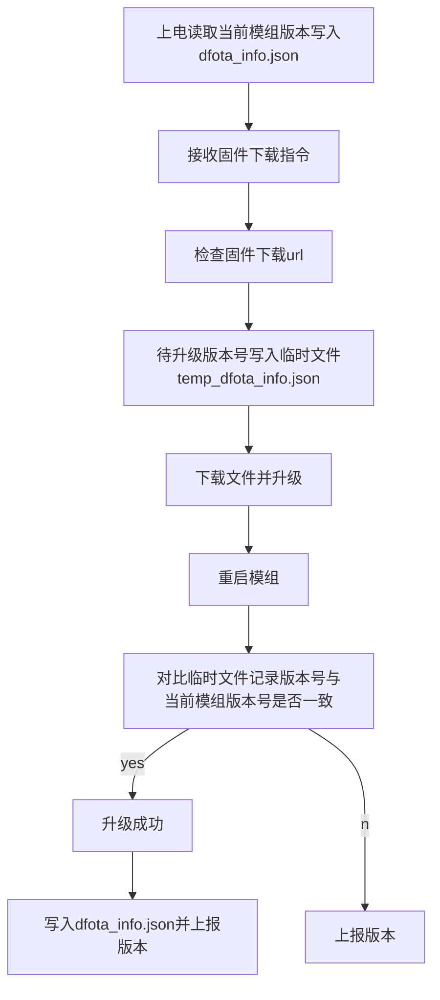
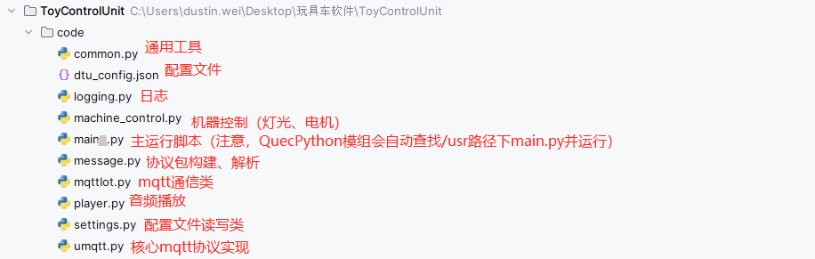
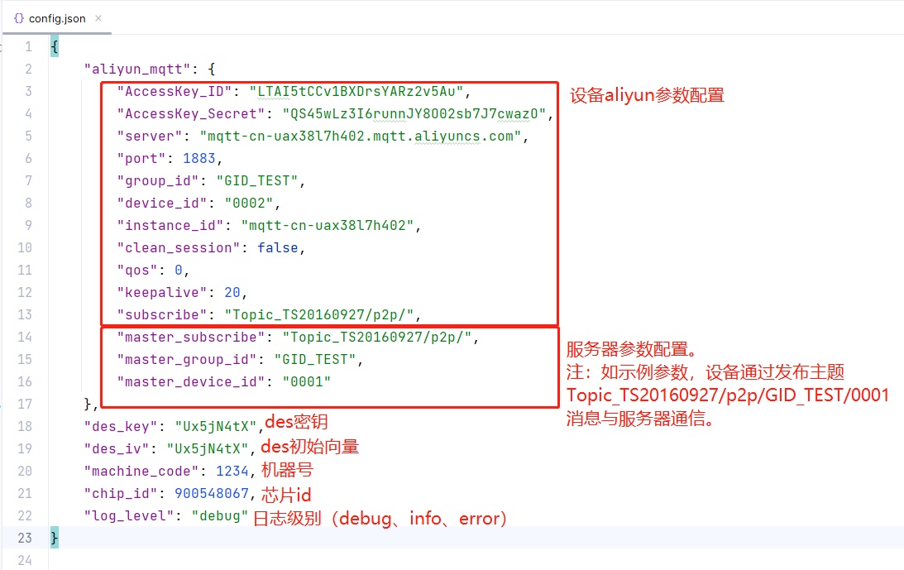
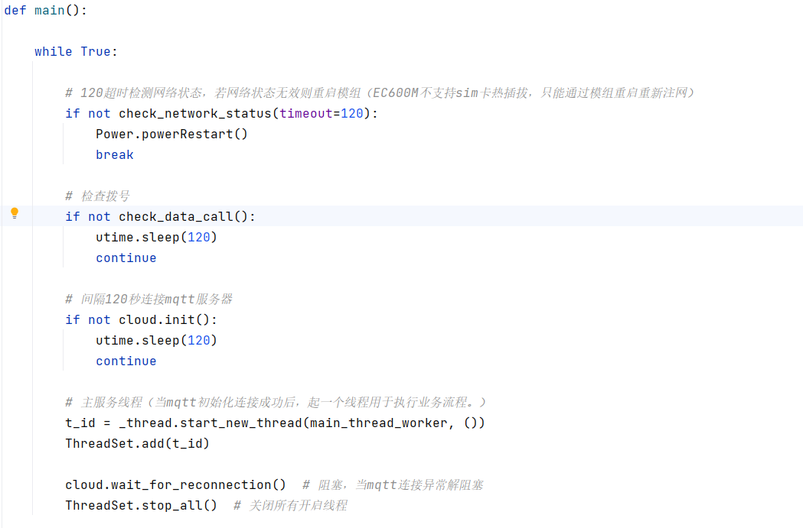
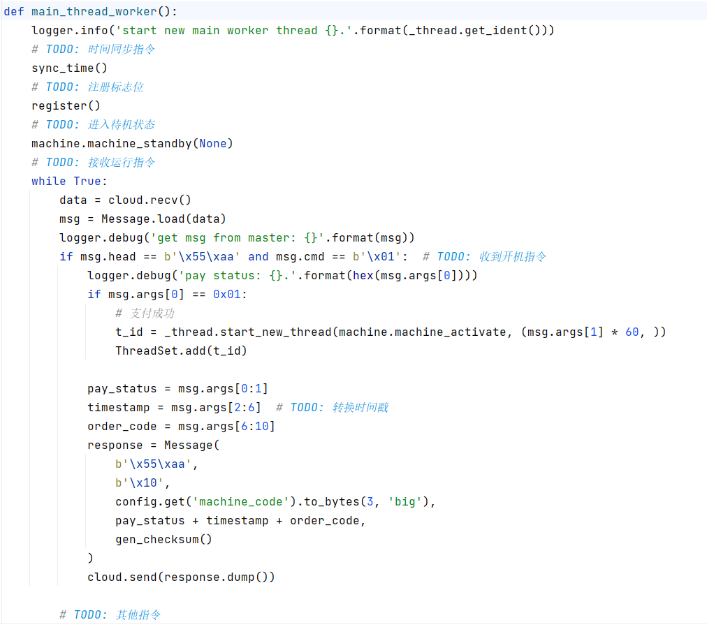
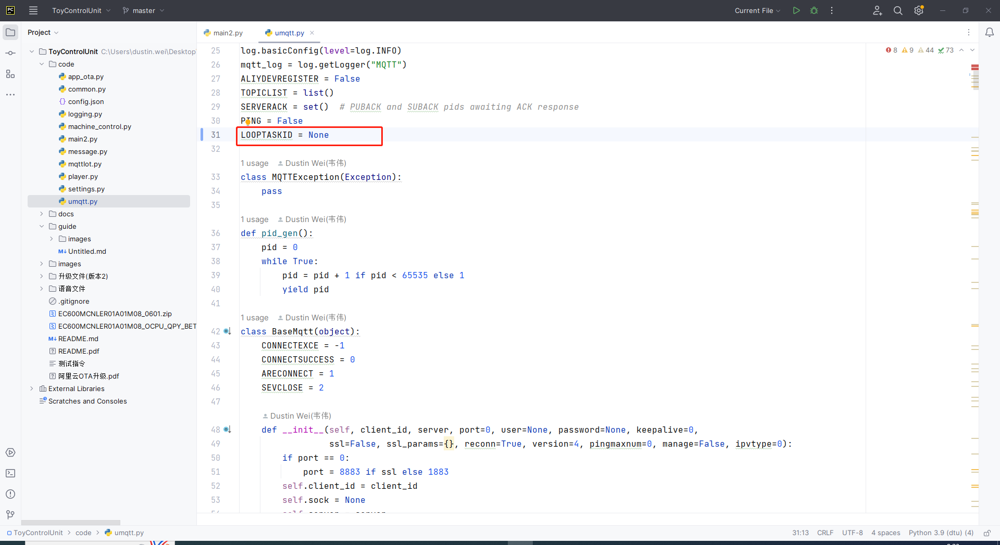
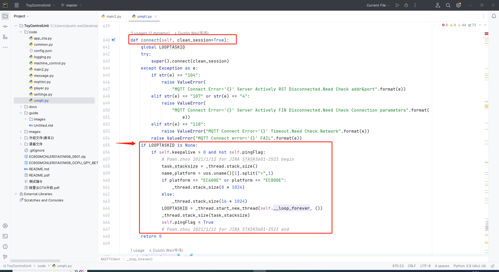

# 《cust_ToyBike项目概述》

GitHub仓库：https://github.com/QuecPython/cust_ToyBike

### 一、项目清单

- 带有DES加密以及支持外挂flash的固件(600MCNLE)。
- 搭载移远QuecPython模组开发板。
- 模组应用代码。

### 二、系统流程图

### 三、业务逻辑

#### 1、机器运行逻辑：

1. 接收0x01指令
2. 响应0x10指令
3. 进入运行状态
   1. 停止吐泡
   2. 清除待机状态标志
   3. 使能音频
   4. 指示灯带亮
   5. 脉冲计数置零
   6. 电机正转
   7. 循环播放歌单
4. 倒计时10s进入待机状态
   1. 播放提示音
   2. 待机状态标志置位
   3. 指示灯灭
   4. 电机停止
   5. 音乐停止

#### 2、定时吐泡业务步骤：

总共有三段时间段，每段时间段有（开始时间点，结束时间点，间隔时间）三元素。在开始时间点与结束时间点之间间隔一定时间持续运行机器20s。

实现思路：采用线程定时60s检测一次当前时间点，时间点符合`开始时间点 <= 当前时间点 <= 结束时间点`后，继续判定当前分钟是否符合`当前分钟 % 时间间隔 == 0`，若符合条件，则启动机器运行20s。

举例说明：假设时间段为`(9:00, 11:00, 30)`，表示在`9:00, 9:30, 10:00, 10:30, 11:00`这5个时间点运行。

#### 3、OTA升级

### 四、目录结构

> 注意：QuecPython模组上电后会，自动检索/usr/main.py脚本并运行。

### 五、配置文件说明

> 配置文件：code/config.json

### 六、脚本说明

主脚本(`main.py`)中的`main`函数为程序入口函数，核心结构是一个带有阻塞的死循环，完成检查注网、检查拨号、初始化mqtt连接、启动业务线程以及阻塞等待mqtt异常重连功能。

函数`main_thread_worker`是业务线程执行函数，主要完成业务初始化，以及接收服务器下行消息(从队列中读取)。

### 七、问题记录

#### 1、MQTTClient多实例无心跳

复现流程：导入`umqtt.MQTTClient`，实例化多个对象并连接服务。

问题现象：仅第一个实例心跳正常，后续实例无心跳。

产生原因：`umqtt`模块中，采用全局变量`LOOPTASKID`(心跳线程ID)记录实例心跳线程，导致除第一个实例心跳线程正常，后续实例没有起心跳线程。

#### 2、修改本地时间戳后MQTTClient无心跳

复现流程：

1. 实例化`MQTTClient`并连接服务
2. 使用`RTC.datetime(时间戳)`修改本地事件 —— 传入的时间戳早于当前时间戳
3. 观察无心跳

问题现象：无心跳

产生原因：实例化`MQTTClient`对象并连接服务时，起的心跳线程时使用`utime.datetime`方法记录"上一次"心跳时间点，如果我们将本地时间戳修改为**过去的时间戳**，那么在下一次判定是否心跳的时候，"当前时间点" + 心跳间隔 < "上一次心跳时间点"，不会触发心跳。

解决方法：记录心跳时间点使用`utime.ticks_ms`记录心跳时间点。

#### 3、600M的SPI引脚对应关系有误

如下，wiki文档记录

|        |                                                              |
| ------ | ------------------------------------------------------------ |
| EC600M | port0: CS:引脚号58 CLK:引脚号61 MOSI:引脚号59 MISO:引脚号60 port1: CS:引脚号4 CLK:引脚号1 MOSI:引脚号3 MISO:引脚号2 |

对应`port1`实测是`port2`。

#### 4、定时器

系统定时器`osTimer`，在函数局部中重复构造(初始化)，会导致定时器失效。