# DTU Tool使用说明

## 概述

本文档主要介绍如何使用**DTU Tool**配合移远**DTU方案**进行开发调试。

DTU工具的功能有两大类：

- 查询与配置DTU设备参数。
- 数据收发：通过DTU设备与云端进行数据收发。

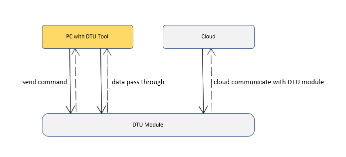

## 参数查询与设置

| 功能             | 描述                                                         |
| ---------------- | ------------------------------------------------------------ |
| 查询IMEI号       | 获取设备的IMEI号                                             |
| 查询本机号码     | 获取DTU设备中SIM卡手机号码                                   |
| 查询信号强度     | 获取csq信号强度，信号强度值范围0~31，数值越大表示信号越好    |
| 设备重启         | 重启DTU设备                                                  |
| 获取当前参数     | 获取DTU设备当前的配置参数，并跳转到参数配置和展示界面        |
| 恢复出厂参数     | 恢复出厂参数并重启DTU设备                                    |
| 保存所有设置参数 | 系统配置参数：云平台类型、固件升级、脚本升级、历史数据存储<br />串口参数配置：串口号、波特率、数据位、校验位、停止位、流控、R485<br />云参数配置：华为云、阿里云、腾讯云、Mqtt私有云、Socket私有云 |


### 查询IMEI号

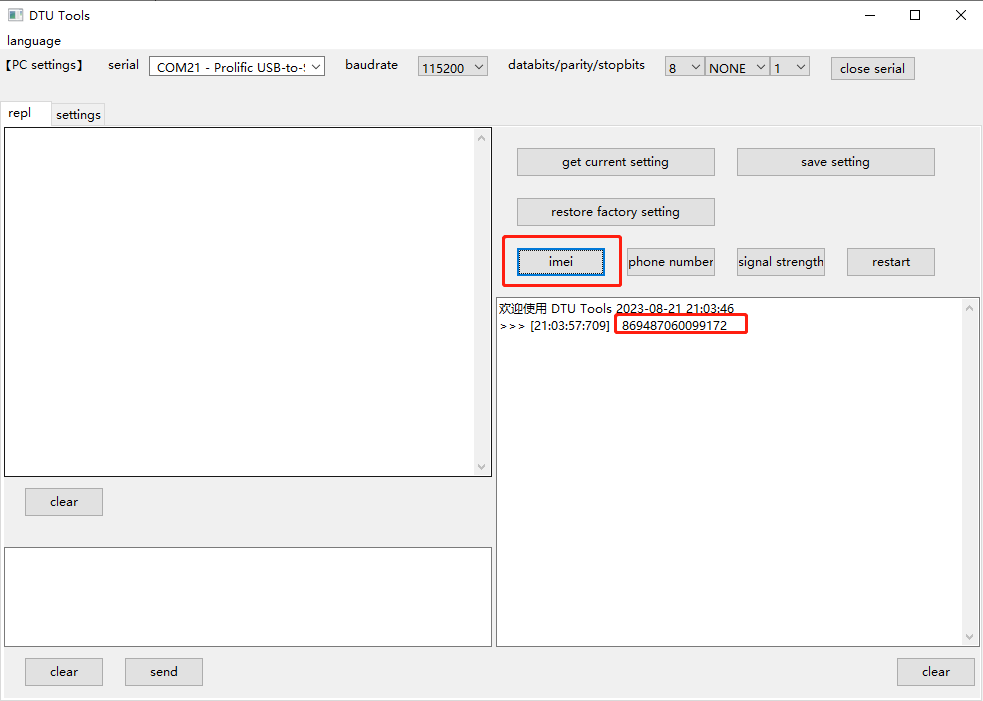

在左侧串口数据显示框中以字符串格式显示出详细地串口数据，右侧命令消息框显示出查询获得的IMEI号。

### 查询本机号码

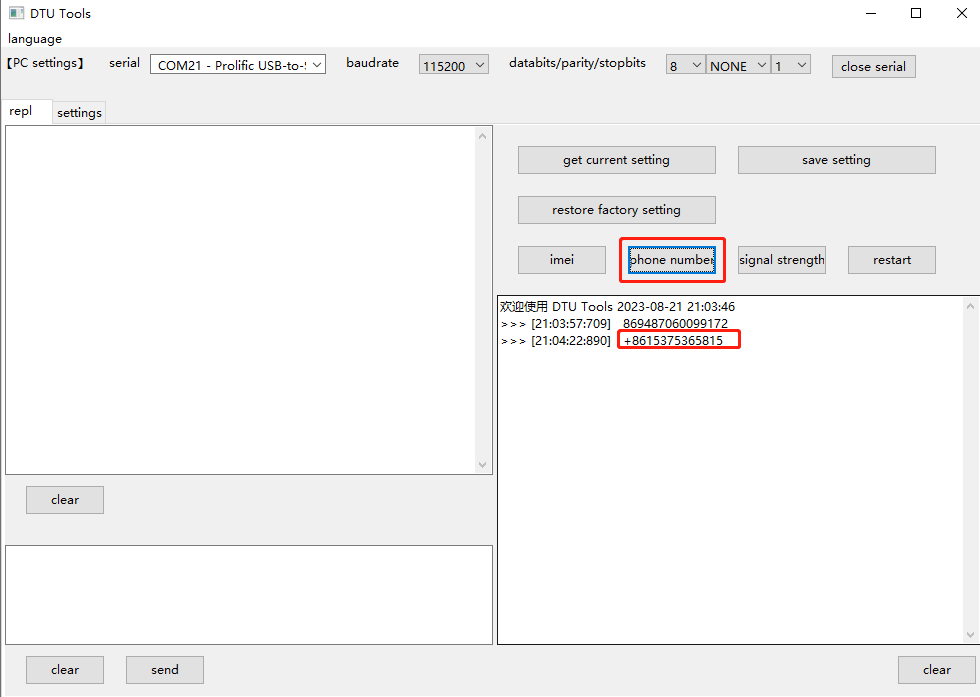

### 查询信号强度

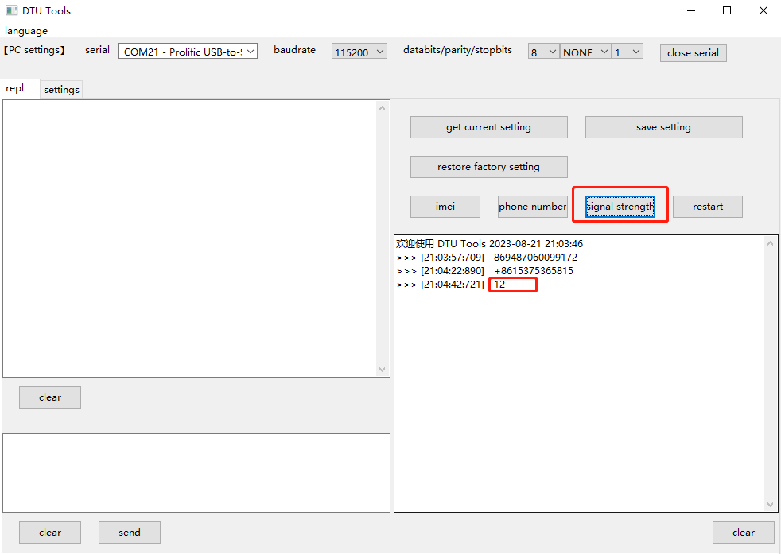

### 设备重启

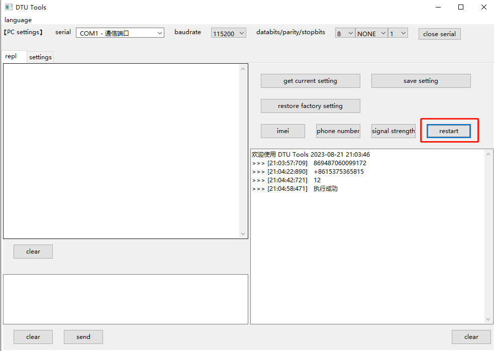

### 读取当前云平台参数

指令区域按键`get current setting`，点击后请求DTU设备当前云参数配置，界面自动跳转配置展示窗口。

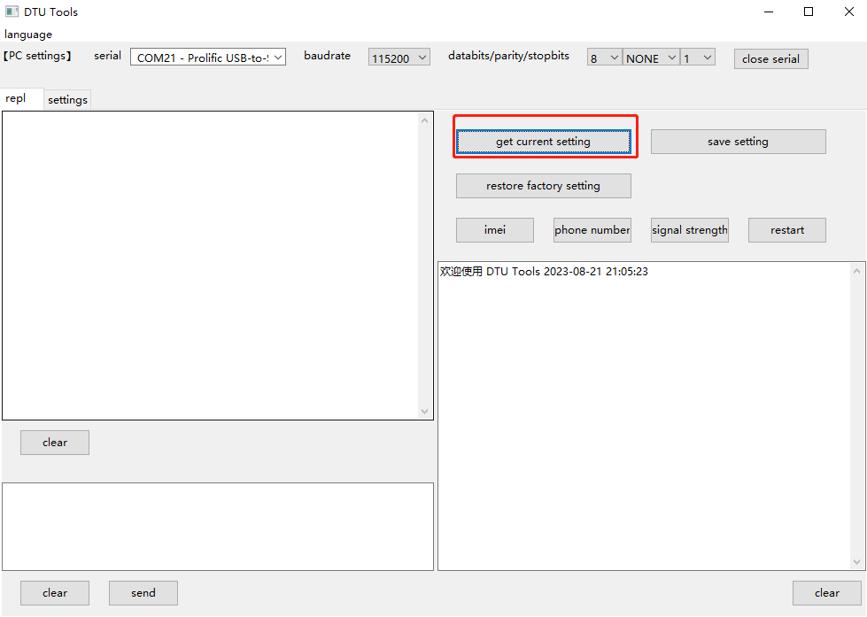

云参数配置和展示窗口。

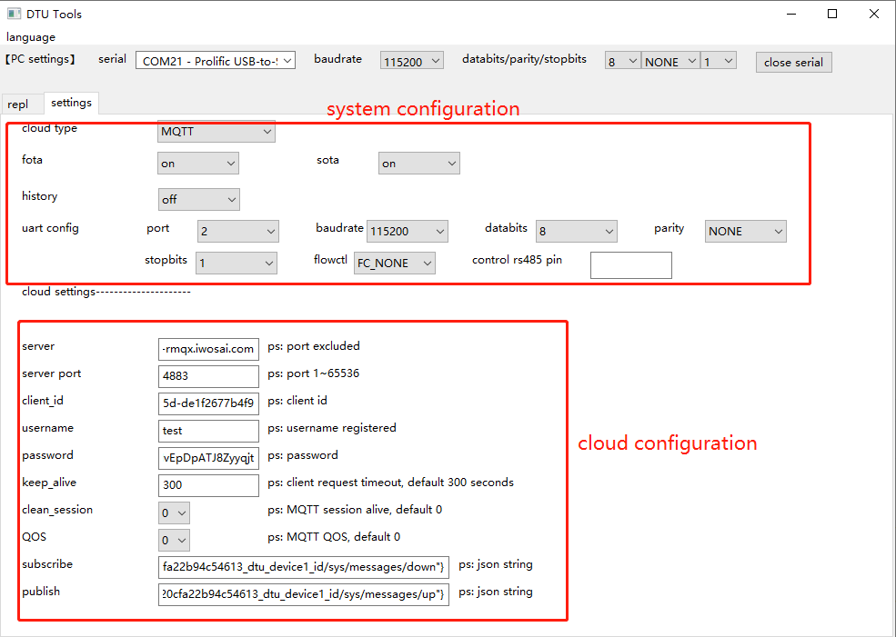

### 保存配置参数

读取当前配置参数后，进入参数配置界面，可以根据实际需求修改配置（也可以不读取，直接填写配置）。

在修改完成后，返回交互页面，点击按键`save setting`即可保存配置。

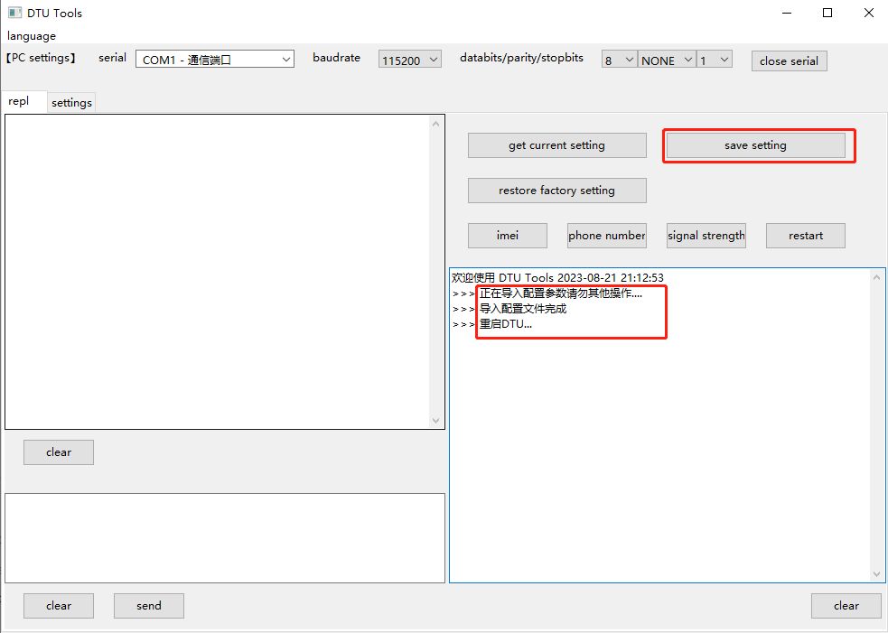

点击按键`restore factory setting`即可恢复出厂设置。

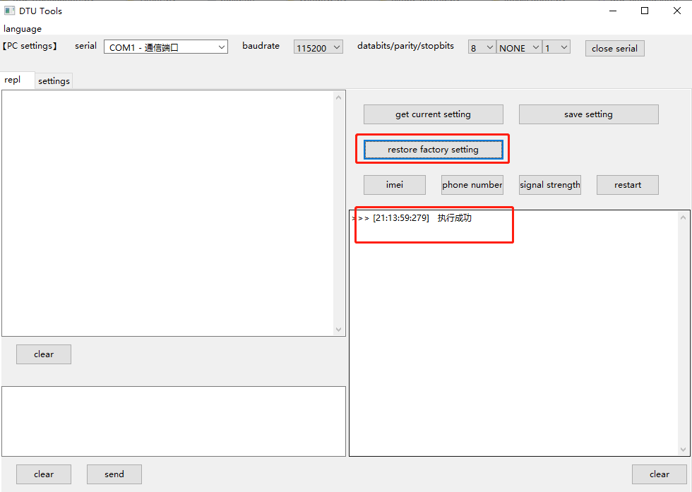

#### 系统参数配置

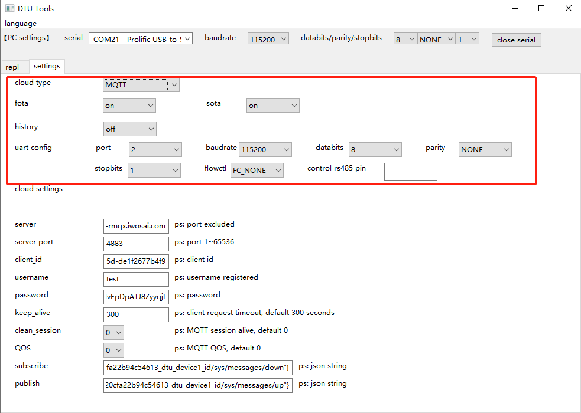
基本配置参数项如上图

| **参数名**         | **含义**                                                     |
| ------------------ | ------------------------------------------------------------ |
| 云平台通道类型     | 云平台选择，可选项：`阿里云`、`腾讯云`、`华为云`、`移远云`、`TCP私有云`、`MQTT私有云` |
| 固件升级           | 是否开启固件OTA升级                                          |
| 脚本升级           | 是否开启项目脚本OTA升级                                      |
| 历史数据存储       | 当通信异常，DTU无法向云端发送数据时，将发送数据保存，待通信恢复正常后重新发送 |
| 串口号             | 外部MCU连接DTU串口号，可选项：`0`，`1`，`2`                  |
| 波特率             | 串口波特率                                                   |
| 数据位             | 奇偶校验                                                     |
| 停止位             | 停止位长度，可选项：`1`，`2`                                 |
| 流控               | 硬件控制流，可选项：`FC_NONE`，`FC_HW`                       |
| 控制485通信方向Pin | 串口发送数据之前和之后进行拉高拉低指定GPIO，用来指示485通信的方向。如`1`、 `2`代表`UART.GPIO1`、`UART.GPIO2` |

#### 云参数配置

云参数配置项会根据基本`云平台通信类型`选择值变化。当云平台通信类型为MQTT时，云参数配置项如下：

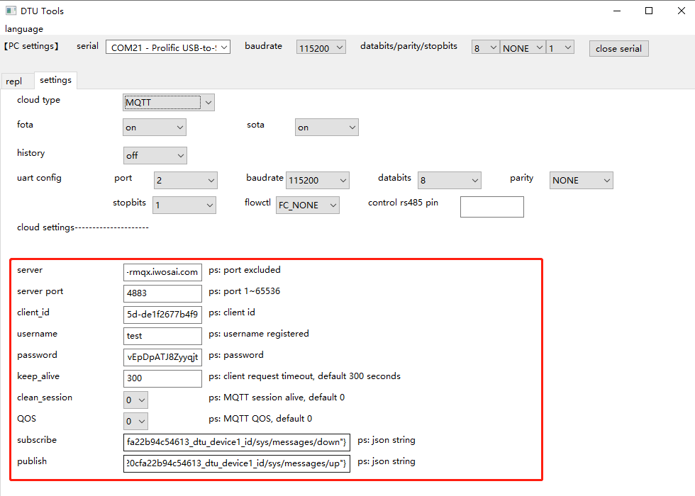

> 订阅主题和发布主题，均采用"**<font color='red'>主题id为key，主题字符串为value的json格式</font>**"。
>
> 举例说明：参数`{"0":"/F79933DC83A4/connect_packet/adv_publish"}`，表示id为`"0"`的主题`"/F79933DC83A4/connect_packet/adv_publish"`。

## DTU数据收发调试

数据发送框的格式要求：数据发送的格式与MCU和DTU通信格式一致。针对和云端通信协议的不同，模块和外部设备（如MCU）通信协议也会不同。当模块和云端通信使用TCP协议时，由于TCP和串口都是数据流的形式，所以直接透传数据，不做任何处理；当模块和云端通信使用MQTT协议时，为了区分不同的数据帧，模块的串口对外协议采用简单的数据帧：`<topic_id>,<msg_len>,<msg_data>"`。

**示例报文：**

上行报文：`“1,6,abcedf”`

下行报文：`“1,6,ijklmn”`

模块和外部设备（MCU）上行报文和下行报文都是采用字符串格式，数据项之间采用`","`相隔。

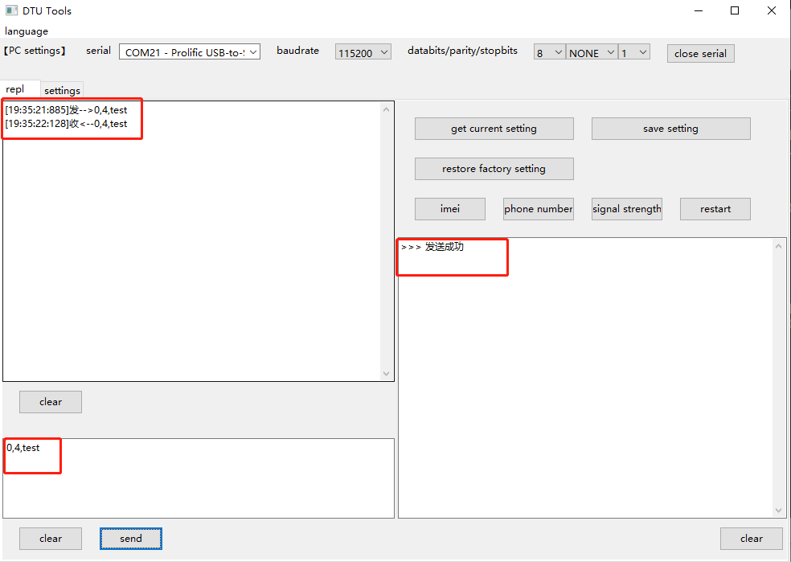

## 二次开发

DTU工具是基于图形框架wxPython开发，现阶段已编译成`dtu_tool.exe`仅支持Windows系统。用户可在Linux或macOS配置Python环境并安装wxPython后可直接运行`dtu_tool.py`或自行编译对应版本的二进制程序即可（编译脚本：`dtu_tool/build.sh`）。

> DTU Tool源代码仓库链接：https://github.com/QuecPython/DTU-tool.git
>
> wxPython官方网站：https://www.wxpython.org

### 安装依赖

配置Python开发环境后，使用`pip`工具安装如下依赖库：

```shell
Pypubsub==4.0.3
wxPython==4.1.1
pubsub==0.1.2
pyserial==3.5
```

### 执行脚本

```shell
python dtu_tool.py
```

### 界面展示

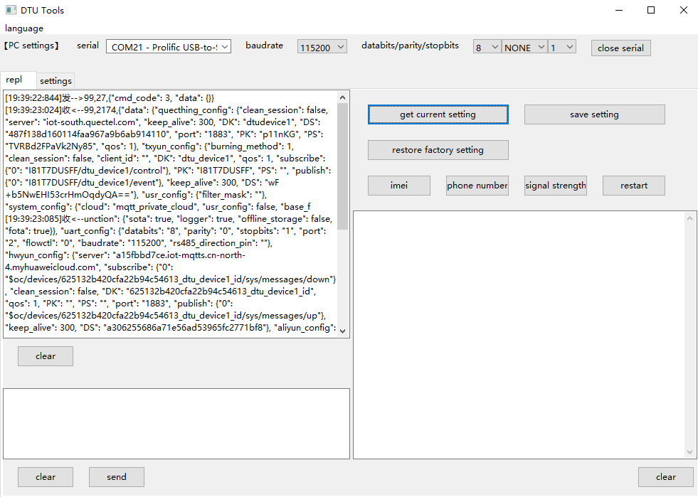

> 注：调试前请启动DTU设备，并在DTU工具的串口配置区域选择与DTU设备通信的串口并打开该串口。

