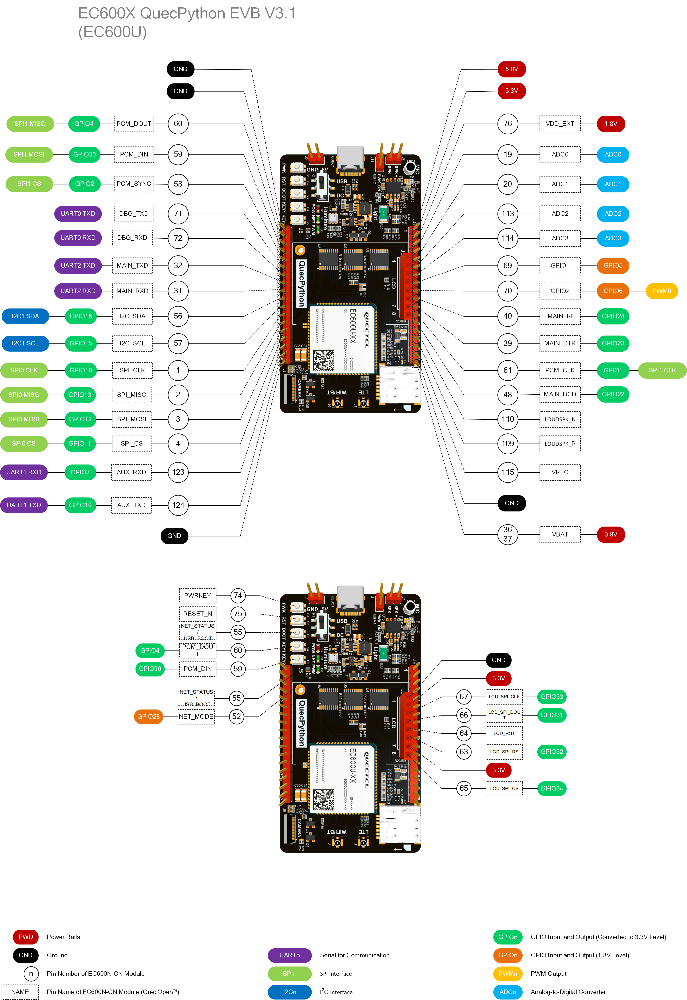

# EC600X开发板介绍

## 快速开始

支持的模组列表

- [EC600N-CN](https://python.quectel.com/products/ec600n-cn)

- [EC600U-CN](https://python.quectel.com/products/ec600u-cn)

- [EC600M-CN](https://python.quectel.com/products/ec600m-cn)

## 功能列表

### 基本概述

QuecPython_EC600X_EVB 开发板是专门针对 QuecPython 制造的、小巧便携的“口袋型”开发板。其体型虽小，但是功能丰富，拥有温湿度传感器、SIM卡座、LCD接口、光敏电阻、MIC等元件。

开发板当前以EC600U作为主控模组，搭载Type-C接口，开发者仅需一条USB Type-C 数据线即可轻松玩转开发板。

### 功能说明

开发板的主要组件、接口布局见下图

## 资料下载

- [EC600U系列模组硬件设计手册（PDF）](https://images.quectel.com/python/2023/04/Quectel_EC600U%E7%B3%BB%E5%88%97_QuecOpen_%E7%A1%AC%E4%BB%B6%E8%AE%BE%E8%AE%A1%E6%89%8B%E5%86%8C_V1.2.pdf)
- [EC600U系列模组产品规格书（PDF）](https://images.quectel.com/python/2023/04/Quectel_EC600U%E7%B3%BB%E5%88%97_LTE_Standard_%E6%A8%A1%E5%9D%97%E4%BA%A7%E5%93%81%E8%A7%84%E6%A0%BC%E4%B9%A6_V1.3.pdf)
- [EC600U系列模组封装（ZIP）](https://images.quectel.com/python/2023/05/Quectel_EC600U_Series_FootprintPart_V1.4.zip)
- [EC600U系列模组参考设计手册（PDF）](https://images.quectel.com/python/2023/05/Quectel_EC600U_Series_Reference_Design_V1.2.pdf)

## 模组资源

### 开发板接口

**J5排针管脚分配表**

| 排针 | 编号 | 名称 | 引脚 | 功能              |
| ---- | ---- | ---- | ---- | ----------------- |
| J5   | 1    | GND  | -    | 接地              |
| J5   | 2    | GND  | -    | 接地              |
| J5   | 3    | P60  | 60   | GPIO4，SPI1 MISO  |
| J5   | 4    | P59  | 59   | GPIO30，SPI1 MOSI |
| J5   | 5    | P58  | 58   | GPIO2，SPI1 CS    |
| J5   | 6    | TX0  | 71   | UART0             |
| J5   | 7    | RX0  | 72   | UART0             |
| J5   | 8    | TX2  | 32   | UART2             |
| J5   | 9    | RX2  | 31   | UART2             |
| J5   | 10   | SDA  | 56   | GPIO16，I2C1      |
| J5   | 11   | SCL  | 57   | GPIO15，I2C1      |
| J5   | 12   | CLK  | 1    | GPIO10，SPI0 CLK  |
| J5   | 13   | MISO | 2    | GPIO13，SPI0 MISO |
| J5   | 14   | MOSI | 3    | GPIO12，SPI0 MOSI |
| J5   | 15   | CS   | 4    | GPIO11，SPI0 CS   |
| J5   | 16   | RX1  | 123  | GPIO7，UART1      |
| J5   | 17   | TX1  | 124  | GPIO19，UART1     |
| J5   | 18   | GND  | -    | 接地              |

**J6排针管脚分配表**

| 排针 | 编号 | 名称  | 引脚   | 功能            |
| ---- | ---- | ----- | ------ | --------------- |
| J6   | 1    | 5V    | -      | 5V              |
| J6   | 2    | 3V3   | -      | 3.3V            |
| J6   | 3    | 1V8   | 76     | 1.8V            |
| J6   | 4    | ADC0  | 19     | ADC0            |
| J6   | 5    | ADC1  | 20     | ADC1            |
| J6   | 6    | ADC2  | 113    | ADC2            |
| J6   | 7    | ADC3  | 114    | ADC3            |
| J6   | 8    | PWM3  | 69     | GPIO5           |
| J6   | 9    | PWM2  | 70     | GPIO6，PWM0     |
| J6   | 10   | P40   | 40     | GPIO24          |
| J6   | 11   | P39   | 39     | GPIO23          |
| J6   | 12   | P61   | 61     | GPIO1，SPI1 CLK |
| J6   | 13   | P48   | 48     | GPIO22          |
| J6   | 14   | LSPKN | 110    | 喇叭通道        |
| J6   | 15   | LSPKP | 109    | 喇叭通道        |
| J6   | 16   | VRTC  | 115    | 实时时钟电源    |
| J6   | 17   | GND   | -      | 接地            |
| J6   | 18   | VBAT  | 36、37 | 3.8V            |

开发板主要管脚布局见下图

| 小提示                              |
| ------------------------------------------------------------ |
| 开发板的更多资料，请访问 <https://python.quectel.com/download> |

### 开发板配置

开发板配备了多种传感器，以及其他外设。外设资源管脚分配表明细如下：

| 序号 | 名称                         | 型号          | 是否支持 | 接口类型 | 引脚  |
| ---- | ---------------------------- | ------------- | -------- | -------- | ----- |
| 1    | 温湿度传感器                 | AHT20         | 是       | I2C      | 56,57 |
| 2    | 光敏电阻                     | GT36528       | 是       | ADC      | 19    |
| 3    | 麦克风                       | GMI6050P-66DB | 是       | SPK      | 23,24 |
| 4    | 功放芯片                     | NS4160        | 是       | SPK      | 21,22 |
| 5    | LCD 显示屏（需选择含屏套餐） | ST7789        | 是       | SPI      | 63~67 |

## 上手准备

首先需要有一台运行有 Windows 10 以上 操作系统的电脑

- **Step1：天线安装**

安装开发板配套的天线,安装位置为LTE天线座位置,并将SIM卡插入开发板上的SIM卡座，如需使用GNSS或者BTWIFI功能，则需在对应的天线座安装天线

- **Step2：开发板连接**

使用USB Type-C数据线连接开发板的Type-C接口和电脑USB口即可完成供电

- **Step3：开发板电源设置**

开发板上USB和DC的电源选择开关拨到USB处,开发板上的PWK_ON跳帽短接AUTO(上电自动开机)

- **Step4：开发板开机**

按住PWK直至主板上电源指示灯亮（主板上丝印为POW的灯）,如果上一步短接PWK_ON则无需长按PWK自动开机
