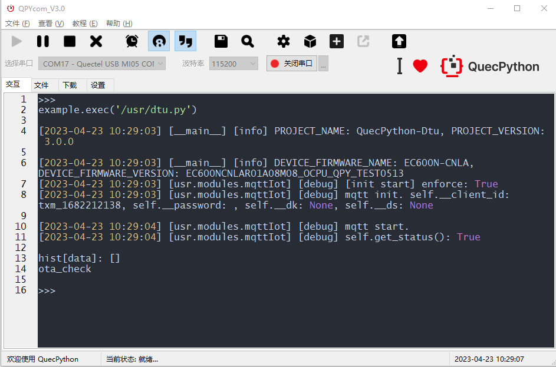
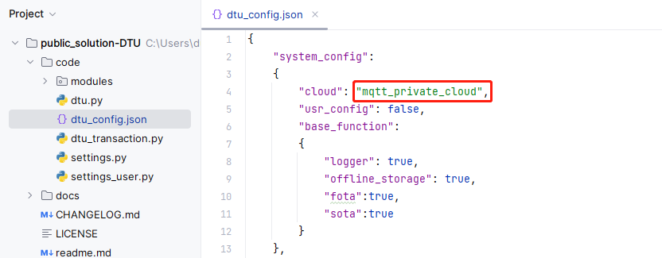

# DTU方案介绍及应用指导

## 方案概述

### DTU简介

DTU (Data Transfer Unit，数据传输单元)，是专门用于将串口**数据转换**为网络数据或将网络数据转换为串口数据通过无线**通信网络**进行传送的**无线终端设备**。具备组网迅速灵活，网络覆盖范围广，建设周期短、成本低等诸多优点。广泛应用于气象、水文水利、地质等行业。

### 基本原理

DTU主要功能就是把设备的数据通过无线的方式传送回云端（后台服务），如`图1：《DTU简介》`中所示，要完成数据传输需要建立一套完成的数据传输系统，这个系统中包括：DTU设备、客户设备(MCU)、移动网络、后台中心（云端）。在DTU设备中插入一张SIM卡，待设备上电后先**拨号和注册网络**；然后通过网络与云端中心服务**建立连接**；后续，DTU设备可以与云端后台服务**双向通信** —— 通过串口接收MCU数据经过处理后上报给云端（**数据上行**），DTU接收云端数据经过处理后通过串口发送给MCU（**数据下行**）。


<center>图1 DTU简介</center> 
> 传感器(温度、湿度等传感器)采集数据发送给设备端MCU，设备端MCU通过串口将采集到的数据通过DTU发送到云端中心服务器，服务器接收到数据可以进行分析、处理、显示、保存等操作。

### 应用领域


<center>图2 DTU应用领域</center>
## 硬件产品介绍

### 简介

DP-DTU-Q600 是一款 LTE CAT1 网络的 DTU，方便集成到工控机、工业设备、传感设备里，其物理尺寸为 72mm x 40.5mm x 20mm 产品具备网络覆盖广、传输延时低的特点，支持三大运营商接入；产品有三个指示灯，方便客户确认设备状态。


<center>图3 DP-DTU-Q600</center>
### 产品规格

| 规格       | 参数                 |
| ---------- | -------------------- |
| 供电范围   | DC5-24V              |
| DC5-24V    | 2PIN 端子            |
| 天线接口   | SMA 外螺纹内孔       |
| SIM 卡接口 | 自弹式 NANO SIM 卡槽 |
| 网络制式   | 4G CAT1 全网通       |
| 通信接口   | 2PIN 端子 RS485      |

### 产品特点

- 内部集成TCP/IP协议栈，并且具有嵌入式操作系统， 具备拨号上网以及TCP/IP数据通信的功能
- 提供串口数据双向转换功能
- 支持自动心跳，保持永久在线
- 支持参数配置，永久保存
- 支持用户串口参数设置
- 支持用户二次开发
-  物联网卡，无需特殊卡，一般物联网卡都可使用 
-  NANO SIM 卡槽 
-  RS485 接口，方便集成  

### 设备调试

#### 前置准备

- 在NANO SIM卡座中插入SIM卡
- 连接好天线
- 接入电源


<center>图4 DP-DTU-Q600硬件接口</center>
#### 连接设备至开发机

本文采用`CP2102 USB to TTL模块`进行连接和调试。


<center>图5 CP2102 USB转485模式</center>
使用2根杜邦线分别连接`485A`、`485B`针脚，将`CP2102`连接至开发机的`USB`口。


<center>图6 DP600R连接开发机</center>
> 连接成功后，设备上电以及连接网络后`power`和`net`指示灯亮起。

#### 使用QPYcom调试

安装QPYCom以及搭建QuecPython开发环境参考文档：https://python.quectel.com/doc/Quick_start/zh/index.html。

##### 打开repl串口


<center>图7 QPYCom打开repl串口</center>
##### 下载脚本

创建下载项目 —— 切换到下载选项卡，点击创建项目，并输入任意项目名称。

> 此处我们创建名为`dtu`的项目。


<center>图8 QPYCom新建项目</center>
选择导入文件 —— 右击`usr`目录，在弹出的选择框中点击**一键导入**，继而选择我们DTU代码仓库中的**code**文件夹 —— 即将code中的所有代码一键导入至模组。如下图所示：


<center>图9 QPYCom一键导入脚本</center>
导入脚本 —— 点击右下角`下载脚本`按钮，即可开始导入脚本。

##### 运行DTU应用

切换至"文件"选项卡，在右边选中"dtu.py"，点击运行按钮，即可开始dtu调试运行，如果需要上电自动运行，只需要将"dtu.py"更名为"main.py"即可实现上电自动运行。


<center>图10 QPYCom执行脚本</center>
DTU运行成功，在QPYcom的"交互"窗口中，可观察到打印如下。

> 应用程序运行依赖具体用户参数配置，比如配置MQTT连接参数等。参考后续DTU方案介绍章节。



<center>图11 QPYCom脚本输出日志</center>
## 方案软件设计

### 系统框图


<center>图12 DTU方案系统图示</center>
组件说明：

- 各类云对象：继承`modules.CloudObservable`并重写相应方法，主要实现云端初始化、连接以及数据收发等功能。
- 订阅器：继承`modules.CloudObserver`并重写相应方法，主要实现订阅并接收云端对象的消息通知，并根据消息类型调用不同的执行器去处理。
- 执行器：主要用于具体的业务处理，被订阅器所调用，默认有下行执行器（处理下行数据转发串口）、OTA升级执行器（处理升级消息和触发升级）、上行执行器（主要用于处理上行数据）。
- 发布器：主要关联云端对象，用于将数据发布给云端。

组件协作流程:

- 构建串口对象 —— 通常至少有一个串口作为通信通道使用，根据实际情况选择使用多个或一个串口。
- 构建下行数据执行器和OTA升级执行器 —— 执行器主要用作于业务处理，用户需要在执行器中实现具体的业务处理逻辑方法。
  - 下行数据执行器需添加一个串口对象，用于处理下行消息 —— 通过串口转发。
  - OTA升级执行器，需要实现具体的升级业务流程。
- 创建云端对象 一一 支持阿里云、腾讯云、MQTT等，根据实际业务需求导入使用。
- 创建订阅器。
    - 云端对象添加订阅器作为其观察者。
  - 订阅器可以有多个，对应下行消息多路处理。
-  创建发布器。 
  - 添加云端对象，作为发布器发布消息的⽬标对象。 
- 创建上⾏数据执⾏器。 
  - 上⾏数据执⾏器，主要⽤于接收串⼝数据处理。 
  - 添加⼀个发布器⽤作该执⾏器发布消息，具体该消息如何发布由发布器来决定。 

> 下行数据支持多路，**订阅器**作为一个观察者可以有多个，当一个云端添加多个订阅器后，一旦有消息下行，则会通知所有订阅器，不同的订阅器可能通过不同的**下行执行器**或**OTA升级执行器**对数据进行处理。
>
> 上行数据支持多路，当需要监听多个串口数据，可以有多个**上行执行器**将多个串口数据转发云端。

### 观察者模式

- **概念：**当对象间存在一对多关系时，则使用观察者模式（Observer Pattern）。比如，当一个对象被修改时，则会自动通知依赖它的对象。观察者模式属于行为型模式。 
- **意图：**定义对象间的一种一对多的依赖关系，当一个对象的状态发生改变时，所有依赖于它的对象都得到通知并被自动更新。
- **主要解决：**一个对象状态改变给其他对象通知的问题，而且要考虑到易用和低耦合，保证高度的协作。
- **何时使用：**一个对象（目标对象）的状态发生改变，所有的依赖对象（观察者对象）都将得到通知，进行广播通知。
- **关键代码：**在抽象类里有一个列表存放观察者们。

在DTU方案设计中，一个云端类（`Socket`和`MqttIot`）对象都是一个**被观察者**，当有下行数据时，会**通知**`RemoteSubscribe`（订阅器，**一个观察者**），而`RemoteSubscribe`会根据不同业务从而调用不同的**执行器**来处理。

### 组件类设计与交互

#### 类继承

##### 云端类继承图示


**CloudObservable**: 可被观察者类，主要用于定义各种云对象类时被继承和重写。主要用户接口有：

- init：云端初始化

- addObserver： 添加一个观察者对象
- delObserver：移除一个观察者对象
- notifyObservers：通知所有观察者
- through_post_data：透传数据发布
- post_data：云端消息发布
- ota_request：云端发布OTA升级请求
- ota_action：执行升级动作

##### 订阅器类继承图示


**CloudObserver**：观察者对象类，主要用于被动接收通知。主要有以下方法：

- `execute`：在被被观察者通知后，会调用该方法执行具体动作。

**RemoteSubscribe**: 订阅器，是一个观察者，用于接收云端下行数据通知。主要方法有：

- `execute`：当被通知时，调用该方法执行具体的业务处理流程。（不同的业务使用不同的执行器处理，在该类对象中定义2种执行器：`__executor`（普通执行器），`__ota_executor`（专用于执行ota升级的执行器））
- `add_executor`：添加执行器。

#### 下行数据处理

下行数据处理时序图：


本方案中定义处理下行数据的执行器有两种：

- `DownlinkTransaction`：下行数据执行器，负责将云端数据通过串口转发。
- `OtaTransaction`：OTA升级执行器，负责处理升级相关业务。

举个例子，当有下行数据时。假设为透传数据，会调用`DownlinkTransaction`执行器通过串口转发数据给MCU；假设为OTA升级消息，则会调用`OtaTransaction`执行器执行升级流程。

#### 上行数据处理

上行数据处理时序图：


本方案中定义处理上行数据执行器有一种：

- `UplinkTransaction`：上行数据执行器，用于接收串口数据并上传云端。
  - 主要属性：
    - `__remote_pub`: 远程发布器，用于上传数据至云端。是`modules.remote.RemotePublish`类对象。
    - `__serial`: 串口对象，用于串口数据收发。定义于`modules.serial.Serial`。
  - 主要方法：
    - `uplink_main`：用于接收串口数据，并上传云端。

## 方案用户使用说明

### 编写配置文件

DTU配置文件路径：`code/dtu_config.json`。

基于mqtt私有云做如下配置：

- 系统配置



- mqtt私有云配置


设备端接口调用流程（接口调用逻辑、参数配置）、上位机工具配置参数、云端配置

### DTU初始化流程及接口说明

`code/dtu.py`中定义了应用类`Dtu`，其实例为应用对象，调用方法`start`即启动应用服务。

```python
from usr.dtu import Dtu

if __name__ == "__main__":
    dtu = Dtu()
    dtu.start()
```

#### 类`Dtu`接口说明

类`Dtu`中定义如下方法，说明如下所示（说明⻅代码中的注释部分，完整代码参阅`dtu.py`使⽤示 例）。 

```python
class Dtu(Singleton):
    
    def __init__(self):
        # 定义一个定时器，用于定时检查OTA升级计划
        self.__ota_timer = osTimer()
        # OTA升级执行器，用于执行OTA升级相关业务
        self.__ota_transaction = None
    
    def __cloud_init(self, protocol):
        # 根据传入protocol参数指定协议，来初始化云端对象和连接云端
        # 该参数对应配置项`system_config.cloud`
        pass
    
    def __periodic_ota_check(self, args):
        # 定时检查OTA升级计划
        pass
    
    def start(self):
        # 初始化DTU，以及启动各项服务
        pass
```

#### 应用服务初始化流程说明

DTU应用服务在`start`函数调用后即初始化和启动各项服务。

初始化流程:

- 加载系统配置
- 创建串口通信对象(`usr.modules.serial.Serial`)
- 创建云端对象(`usr.modules.mqttIot.MqttIot`或其他云对象)
- 创建GUI工具通信对象(`usr.modules.dtu_transaction.GuiToolsInteraction`)
- 创建数据上行执行器(`usr.modules.dtu_transaction.UplinkTransaction`)
- 创建数据下行执行器(`usr.modules.dtu_transaction.DownlinkTransaction`)
- 创建OTA升级执行器(`usr.modules.dtu_transaction.OtaTransaction`)
- 创建订阅器(`usr.modules.remote.RemoteSubscribe`)
- 创建发布器(`usr.modules.remote.RemotePublish`)
- 启动定时器定期检查OTA升级计划
- 创建服务线程持续读取串口数据，解析并上传至云端

流程步骤详细说明：

（1）加载系统配置

```python
from usr.settings import settings
```

`settings`是一个全局的配置文件(`Settings`)对象，对应是`/usr/dtu_config.json`配置文件参数，采用json格式持久化。

方法：

- `get`：获取当前所有配置参数（即json文件导入的dict类型数据）
- `set(opt, val)`：设置`opt`配置项，参数是`val`。
- `save`：持久化保存配置。
- `remove`：删除配置文件。
- `reset`：恢复默认配置。
- `set_multi(**kwargs)`：批量设置参数。

（2）创建串口通信对象

```python
from usr.modules.serial import Serial

# Serial initialization
serial = Serial(int(uart_setting.get("port")),
                int(uart_setting.get("baudrate")),
                int(uart_setting.get("databits")),
                int(uart_setting.get("parity")),
                int(uart_setting.get("stopbits")),
                int(uart_setting.get("flowctl")),
                uart_setting.get("rs485_direction_pin"))
```

`serial`是一个串口通信对象(`Serial`)。

方法：

- `write(data)`：传入写入data字节。
- `read(n, timeout)`: 串口读n个字节，超时时间为timeout。

（3）创建云端对象

`Dtu.__init_cloud`方法用于创建云端对象（根据系统配置文件，创建不同的云端对象）。

```python
class Dtu(object):
    
    def __init_cloud(self, protocol):
        if protocol == 'mqtt':
            cloud_config = settings.current_settings.get("mqtt_private_cloud_config")
            client_id = cloud_config["client_id"] if cloud_config.get("client_id") else modem.getDevImei()
            cloud = MqttIot(cloud_config.get("server", None),
                                int(cloud_config.get("qos", 0)),
                                int(cloud_config.get("port", 1883)),
                                cloud_config.get("clean_session"),
                                client_id,
                                cloud_config.get("username"),
                                cloud_config.get("password"),
                                cloud_config.get("publish"),
                                cloud_config.get("subscribe"),
                                cloud_config.get("keep_alive")
                                )
            cloud.init(enforce=True)
            return cloud
        else:
            # 略，其他云端对象初始化参阅`code/dtu.py`
            pass
        
    def start(self):
        # ...
        cloud = self.__cloud_init(settings.current_settings["system_config"]["cloud"])
        # ...
```

以MQTT为例，从系统配置文件中读取mqtt配置参数，实例化`MqttIot`对象传入参数，并调用`MqttIot.init`方法完成云对象的初始化操作。

方法：

- `addObserver`: 添加观察者对象，用于云端在接收下行数据后，交由该对象处理。
  - 订阅器：当接收云端通知（携带下行数据）后，调用执行器处理。

（4）创建GUI工具通信对象

```python
gui_tool_inter = GuiToolsInteraction()
```

GUI通信对象`GuiToolsInteraction`，用于解析串口下发的上位机指令，并处理具体指令业务。

方法：

- `parse_serial_data`：解析串口数据。

（5）创建数据上行执行器

```python
up_transaction = UplinkTransaction()
up_transaction.add_module(serial)
up_transaction.add_module(gui_tool_inter)
```

方法：

- `add_module`：添加模块对象。
  - 串口对象：上行执行器通过串口对象读取串口数据。
  - GUI通信对象，通过GUI对象解析读取到的串口数据。
  - 发布器对象，通过该对象将数据发布给云端。
- `uplink_main`：读取串口数据，并使用GUI对象解析（如果是指令数据则处理指令业务，如果是上行数据则转发给云端）。

（6）创建数据下行执行器

```python
down_transaction = DownlinkTransaction()
down_transaction.add_module(serial)
```

方法：

- `add_module`：添加模块对象
  - 串口对象：下行执行器，通过串口对象转发下行数据。
- `downlink_main`：用于处理下行数据。

（7）创建OTA升级执行器

```python
ota_transaction = OtaTransaction()
```

方法：

- `ota_check`：检查OTA升级计划
- `event_ota_plain`：响应升级计划（在接收到下发的升级计划后，校验参数和启动升级流程）
- `add_module`：添加模块对象
  - 发布器对象：通过发布器对象上报升级状态，或者主动请求升级计划。

（8）创建订阅器

```python
remote_sub = RemoteSubscribe()
remote_sub.add_executor(down_transaction, 1)
remote_sub.add_executor(ota_transaction, 2)
cloud.addObserver(remote_sub)
```

方法：

- `add_executor`：添加执行器。
  - 下行执行器：通过串口转发数据。
  - OTA升级执行器：解析下行升级消息，并处理升级请求。

（9）创建发布器

```python
remote_pub = RemotePublish()
remote_pub.add_cloud(cloud)
up_transaction.add_module(remote_pub)
ota_transaction.add_module(remote_pub)
```

方法：

- `add_cloud`：添加云端对象，用该云端对象发布消息。

（10）启动定时器定期检查OTA升级计划

```python
# 每600秒检测一次升级计划
self.__ota_timer.start(1000 * 600, 1, self.__periodic_ota_check)
```

（11）创建服务线程持续读取串口数据，解析并上传至云端

```python
# Start uplink transaction
_thread.start_new_thread(up_transaction.uplink_main, ())
```

启动单独线程执行`up_transaction.uplink_main`，`uplink_main`方法中，持续读取串口数据，使用`GuiToolsInteraction`解析串口数据处理上位机指令，或使用`RemotePublish`转发数据给云端。


