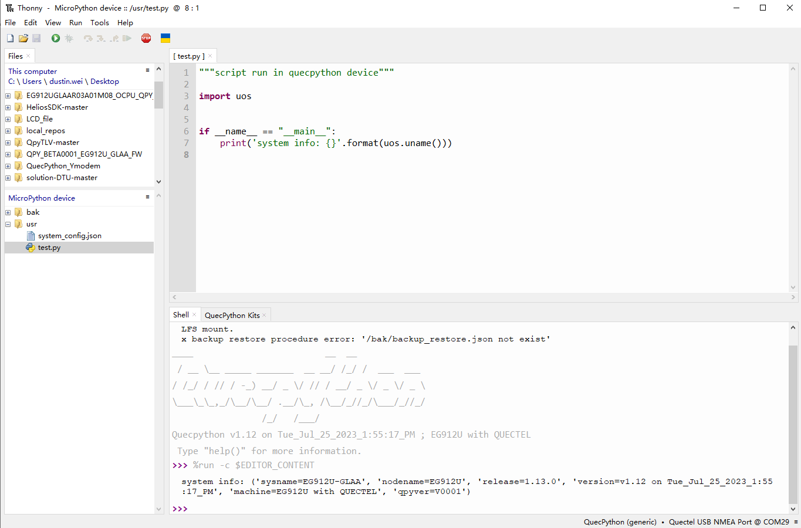

# 基于 Thonny IDE 开发 QuecPython

## 简介

Thonny是一款非常适合初学者的Python IDE，具备易于上手、语法检查、自动补全等诸多对用户友好的实用功能。非常适合用来学习python。

为了支持用户在Thonny平台上实现QuecPython开发，为此QuecPython团队开发了`QuecPython-Kits`插件，用户只需使用Thonny安装该插件即可。

本文档，旨在介绍Thonny的功能和用法，以及`QuecPython-Kits`插件的安装和使用方式。

## Thonny环境搭建

### 下载

Thonny支持三种主流操作系统：windows、macos、linux。

访问Thonny官方网站(https://thonny.org/)。


根据屏幕右上角对应操作系统可以看到有如下安装方式（以windows为例)。


### 安装方式

Thonny应用程序安装支持两种安装方式：

- 安装Thonny+Python捆绑包 —— 这种方式本质是将Python环境和Thonny打包在一起，即可一键安装使用，快捷方便，推荐新手使用此方式。捆绑包的方式安装又分为两种，对应上图：
  - 使用Installer安装
    - ` Installer with 64-bit Python 3.10` —— 64位python3.10安装程序
    - ` Installer with 32-bit Python 3.8` —— 32位python3.8安装程序
  - 免安装版本
    - `Portable variant with 64-bit Python 3.10` —— 64位python3.10免安装版本（解压即可使用）
    - `Portable variant with 32-bit Python 3.8` —— 32位python3.8免安装版本（解压即可使用）
- 单独安装Thonny —— Thonny应用本质是以python包的形式存在，当用户已经具备python环境，即可通过`pip install thonny`单独安装Thonny。这种方式更适合开发者。对应上图：
  - `Re-using an existing Python installation (for advanced user)`

### 使用Installer安装

以`64-bit Windows 10`环境下，安装程序`Installer with 64-bit Python 3.10`为例。下载该安装程序`thonny-4.1.2.exe`后，双击运行后点击`Next`即可一键安装。安装完毕后找到桌面应用程序图标即可运行。


### 使用免安装版本

以`64-bit Windows 10`环境下，`Portable variant with 64-bit Python 3.10`为例。下载安装包`thonny-4.1.2-windows-portable.zip`，解压后，双击运行`thonny.exe`即可。


### 使用PIP安装

> 注意事项：
>
> 1、这种方式面向开发者，若采用该方式安装Thonny，需具备python环境。移步python官方下载(https://www.python.org/downloads/)安装python开发环境。
>
> 2、`pip`是python的包管理器，通过该程序可以在shell环境下安装python应用包。

具备python环境后，通过`pip install thonny`安装thonny。


安装完毕后，可以通过`pip list`查看当前安装的thonny包（`thonny==4.1.2`）。


通过`python -m thonny`运行Thonny应用程序，随后Thonny应用程序启动窗口界面即显示。

> 命令解释：`python -m <package>`，`-m`参数后跟一个模块/包名，将模块/包作为脚本运行。


## 编写&运行脚本

### 选择&配置解释器

在菜单栏中选择`Run --> Configureinterpreter`。


在弹出的对话框中，选择python解释器`Local Python3`即为本地python环境，在下方的`Python executable`栏中选择`python.exe`路径。如果采用捆绑包的方式安装，路径是默认配置好的。如果是单独安装，则用户需指定本地python解释器路径。


### 运行第一个脚本

在Thonny文本编辑区域，编辑python脚本程序。


> `ctrl + s`快捷键弹出窗口中选择路径即可保存当前python脚本文件。

## QuecPython环境搭建

### 下载安装QuecPython-Kits插件

#### 使用Thonny界面安装

菜单`Tools`，选择`Manage plug-ins...`打开插件管理界面。


在搜索栏中搜索`thonny-quecpython`。


点击`Install`下载按钮即可下载安装插件。

#### 使用PIP安装

```shell
pip install thonny-quecpython -i {pip国内源}
```

pip国内源推荐

| 源     | url                                            |
| ------ | ---------------------------------------------- |
| 清华   | https://pypi.tuna.tsinghua.edu.cn/simple/      |
| 阿里   | http://mirrors.aliyun.com/pypi/simple/         |
| 网易   | https://mirrors.163.com/pypi/simple/           |
| 百度   | https://mirror.baidu.com/pypi/simple/          |
| 中科大 | https://pypi.mirrors.ustc.edu.cn/simple/       |
| 腾讯   | https://mirrors.cloud.tencent.com/pypi/simple/ |

#### 打开插件界面

菜单栏`Tools`，选择`QuecPython Kits`即可打开插件界面，如下图在屏幕的下方子界面所示。


## QuecPython固件下载

点击插件栏`选择路径`按钮，选择需要下载的固件文件后，点击`下载固件`即进入模组固件下载流程。完成后如下图所示。


> 下载固件前请确保连接模组至电脑。

## QuecPython脚本运行

借助于Thonny，我们可以直接通过REPL写入代码运行调试，也可以编辑脚本文件运行调试。

### 选择&配置解释器

在菜单`Run -> Configure interpreter`中选择`QuecPython(generic)`。


> 本文档使用`EG912U-GLAA`模组测试，交互口为`Quectel USB NMEA Port @ COM29`。

选择好交互串口后，Thonny主界面下方shell子界面会显示Quecpython欢迎字样。在交互中输入`uos.uname()`可以查看当前模组型号版本等信息。


### 编辑&运行脚本

在编辑栏中编辑quecpython脚本代码，点击运行按钮，脚本代码即自动在模组中运行。观察shell交互界面中脚本的打印输出。


### 保存脚本文件

Thonny可以将脚本文件保存本地，亦可保存至设备模组中。

在编辑栏中编辑好脚本文件后，快捷键`ctrl+s`或点击左上角保存按钮会弹出对话框供工具选择保存至设备还是保存本地。

保存对话框：


输入文件名&选择设备保存文件系统路径(`/usr`)：


菜单`View -> Files`可以打开左侧栏显示本地和设备的文件系统目录结构。如下，可以看到我们刚才保存的脚本文件`/usr/test.py`。用户也可以直接选中设备中的脚本文件双击打开显示在Thonny编辑栏中直接进行编辑和调试。



## QuecPython-Kits插件开源代码下载

`QuecPython-Kits`开源项目命名为`thonny-quecpython`，github仓库链接：https://github.com/QuecPython/thonny-quecpython。

`thonny`开源项目仓库链接： https://github.com/thonny/thonny。